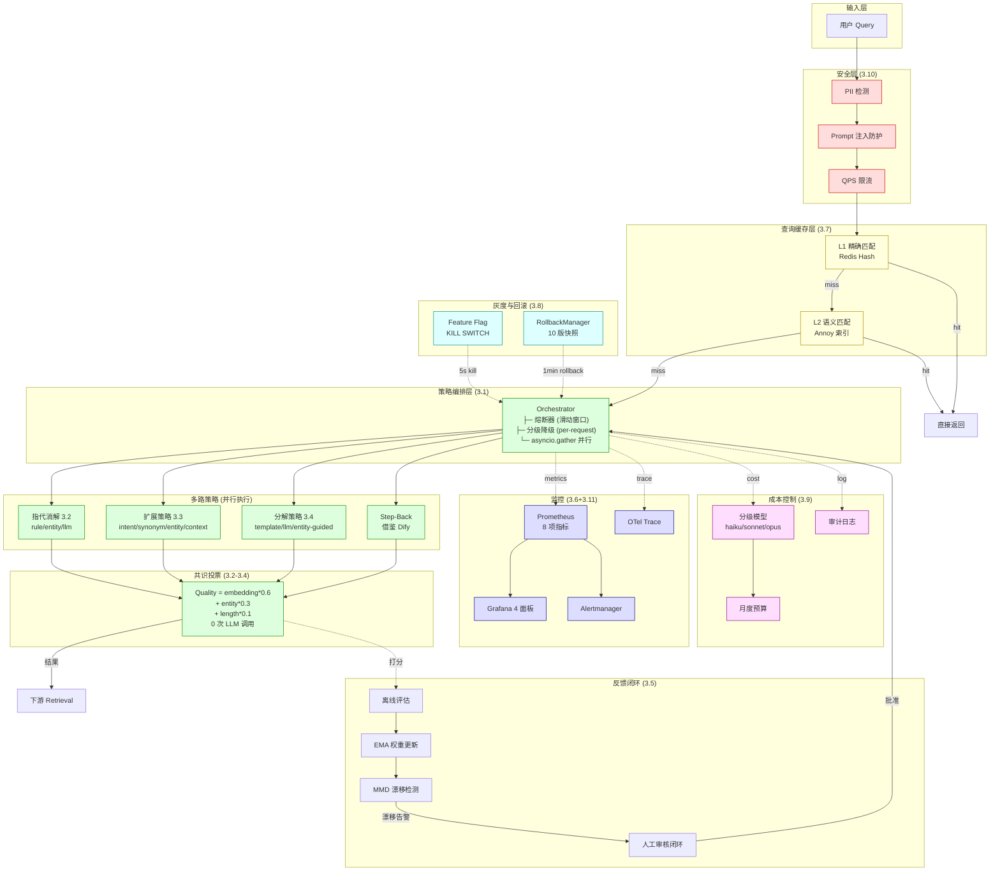
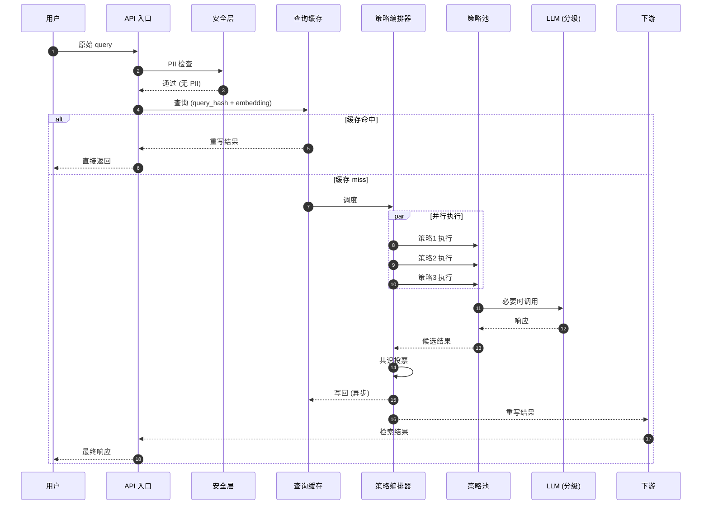
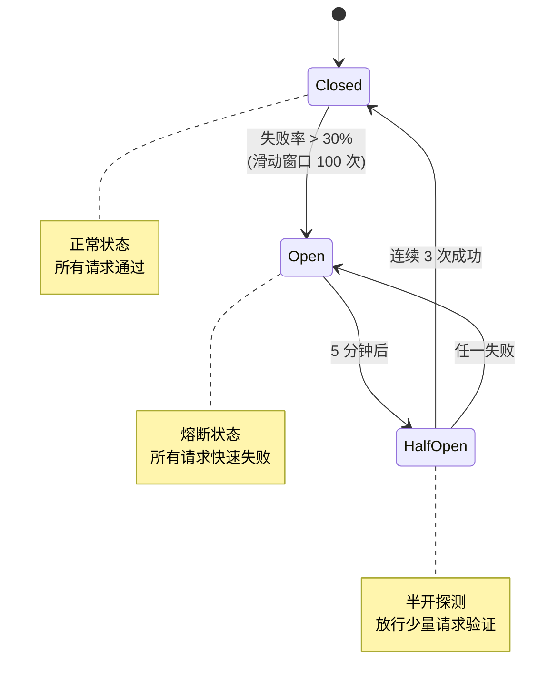
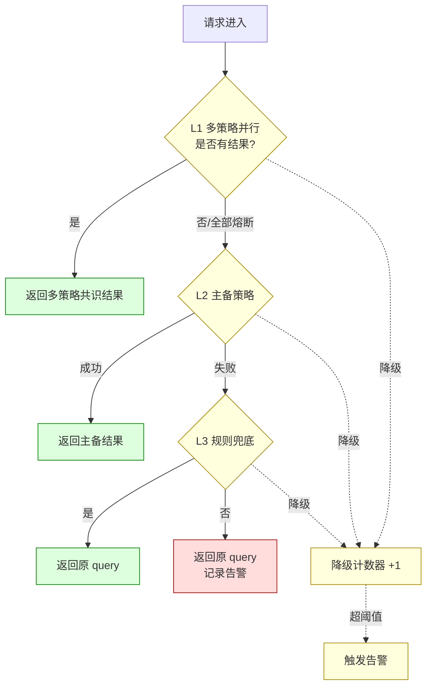
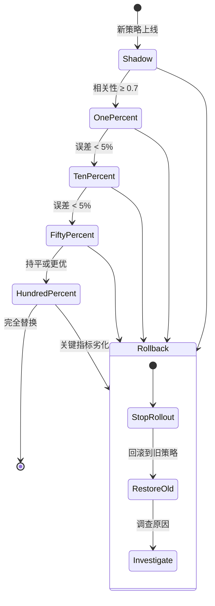

# Design: Query Rewriter 优化方案（v3.1 加固版）

> **v3.1 更新日志**：基于 v3.0 全面加固——修复 6 个 P0 代码 bug、补齐 5 个生产缺失维度（缓存/冷启动/成本/安全/可观测性）、扩展验证指标到 14 项。详见 §五 方案对比与选定 章节中的"v3.0→v3.1 关键升级"小节。

> 所属项目：[SPMA 全局概览](SPMA-design-00-global-overview.md)
> 所属模块：[Supervisor Agent 设计](SPMA-design-01-supervisor-agent.md) — Round 1 核心组件
> 设计依据：SPMA-design-10-query-rewrite.md 优化升级
> 参考方案：Dify Query Rewrite、QAnything Multi-Route Expansion、Cohere Rerank、RAGAs

---

## 一、问题回顾：当前实现的核心缺陷

> **更新于 2026-06-29**：本文档为 v3.1 目标态设计;实际代码已经走在 P7 中段(15 个 commit 推进了缓存/审计/状态/指标,详见 §1.2)。下表 §1.1 为"实际未完成项"而非 v3.0 缺陷,§1.2 列出已实现项及改进空间。

### 1.1 实际未完成项(15 项,基于代码核查)

| ID | 类别 | 缺陷 | 实际代码状态 | 严重程度 |
|----|------|------|-------------|---------|
| ~~G1~~ | ~~P1~~ | ~~`synonym_map` SQL 表不存在~~ | ✅ 已修复: migration 004 创建表 (commit 3791498f) | - |
| ~~G2~~ | ~~P1~~ | ~~`graph.rewrite_node:50` 硬编码 `synonym_map = None`~~ | ✅ 已修复: `_load_synonym_map()` 替换 stub (commit c7a156d7 / 9d5fca3f / b3863073) | - |
| ~~G3~~ | ~~P2~~ | ~~`StrategyOrchestrator` / `FallbackManager` 不存在~~ | ✅ 已修复: 新建 `strategy_orchestrator.py`(80 行)+ `fallback_manager.py`(82 行),L1→L2→L3 三级降级 + 1000 并发压测 + asyncio.to_thread 防 L3 阻塞 (squash merge P2 commit chain) | - |
| ~~G4~~ | ~~P2~~ | ~~`CircuitBreaker` 在 `infrastructure/circuit_breaker.py` 已实现,但 supervisor 模块**未引用**~~ | ✅ 已修复: `StrategyOrchestrator` 集成 `get_circuit_breaker` + `cb.call`;新增 `is_open()` helper 做执行前过滤;`graph.py` 模块级 `_orchestrator` 单例持有 P3-P5 10 个策略名 CB (squash merge P2 commit chain) | - |
| ~~G5~~ | ~~P3~~ | ~~`_resolve_references` 是单策略 + 简单关键词匹配~~ | ✅ 已修复: 多路并行(rule/entity/llm)+ SemanticVoter 共识度投票(主文件 ADR-004),zero-LLM voter (squash merge P3 commit chain) | - |
| **G6** | P4 | `_expand_query` 是单策略 + 简单意图感知 | `query_rewriter.py:282` | 🟡 P1 |
| **G7** | P5 | `_decompose_query` 是单策略 + 4 步 JSON 解析兜底 | `query_rewriter.py:137` | 🟡 P1 |
| **G8** | P6 | 离线评估 / EMA 权重进化未实现 | 无相关类 | 🟡 P1 |
| **G9** | P6 | 分布漂移检测(MMD)未实现 | 无相关类 | 🟡 P2 |
| **G10** | P6 | 人工审核闭环(HumanInTheLoop)未实现 | 无相关类 | 🟡 P2 |
| **G11** | P7 | `CostController`(分级模型 + 预算)未实现 | 无相关类 | 🟡 P1 |
| **G12** | P7 | `QPSLimiter` 未实现 | 无相关类 | 🟡 P1 |
| **G13** | P7 | `PIIDetector` 未实现 | 无相关类 | 🔴 P0(合规) |
| **G14** | P7 | `PromptInjectionGuard` 未实现 | 无相关类 | 🔴 P0(安全) |
| **G15** | P8 | `StrategyFeatureFlag` / `RollbackManager` 未实现 | 仅 `qr_state.bump_weights_version` / `write_weights_snapshot` | 🟡 P1 |

### 1.2 已完成项(12 项,基于代码核查)

| 已完成 | 文件 / commit | 改进空间 |
|--------|--------------|---------|
| QueryCache(L1 Redis + L2 pgvector + lookup_or_compute) | `query_cache.py` + `0850ef7a` `3831ee87` `bf8ae795` | L2 距离阈值调优;hit/miss 比例监控 |
| QrAuditBuffer(5s 异步 flush + PG 持久化兜底) | `qr_audit.py` + `81c9cdac` `6249bf96` | 告警规则待补(`qr_audit_flush_lag_seconds`) |
| qr_state_meta(权重+synonym 版本号 + 快照写入) | `qr_state.py` + migration 002 | 多实例下读写一致性 |
| 8 项 Prometheus 指标(已实现,见下) | `src/spma/observability/qr_metrics.py` | **指标名与本主文件 §3.11 描述略不同,以代码为准** |
| OTel trace(`qr.cache.lookup` span) | `b9c983aa` | 待补 `qr.strategy.*` / `qr.fallback` spans |
| `rewrite_queries` 注入 cache/audit_buffer/versions | `query_rewriter.py:18-60` + `d92cbc0b` | 已与 P7 子系统正确集成 |
| CircuitBreaker 完整实现(registry + 装饰器 + async lock) | `infrastructure/circuit_breaker.py` | supervisor 模块需引入 |
| `_normalize_with_synonyms`(单策略 + 长度优先匹配) | `query_rewriter.py:212` | 待扩展为多路 |
| `_expand_query`(单策略 + LLM 生成) | `query_rewriter.py:282` | 待扩展为多路 |
| `_decompose_query`(单策略 + 4 步 JSON 兜底) | `query_rewriter.py:137` | 待扩展为多路 |
| `_resolve_references`(关键词触发 + LLM 替换) | `query_rewriter.py:243` | 待扩展为多路 |
| 13 个单元测试 + 1 集成测试 | `tests/unit/agents/supervisor/test_*.py` | 覆盖率尚可,待补 P6/P7 缺的测试 |

**已实现的 8 项 Prometheus 指标实际名称**(以 `src/spma/observability/qr_metrics.py` 为准):

| 常量名 | Prometheus name | 含义 |
|--------|-----------------|------|
| `COUNTER_CACHE_REQUESTS` | `qr_cache_requests_total` | 缓存请求数,labels={layer, stage} |
| `COUNTER_CACHE_ERRORS` | `qr_cache_errors_total` | 缓存错误数,labels={layer, error_type} |
| `HISTOGRAM_CACHE_LATENCY` | `qr_cache_latency_seconds` | 缓存延迟,labels={layer, op} |
| `HISTOGRAM_CACHE_L2_DISTANCE` | `qr_cache_l2_distance` | L2 余弦距离,labels={match_type} |
| `COUNTER_FALLBACK` | `qr_fallback_total` | 降级触发,labels={level, stage} |
| `GAUGE_WEIGHT_VERSION` | `qr_state_weight_version` | 当前权重版本(PG qr_state_meta) |
| `GAUGE_FLUSH_LAG` | `qr_audit_flush_lag_seconds` | 审计 buffer flush 延迟 |
| `GAUGE_CACHE_HIT_RATIO` | `qr_cache_hit_ratio` | 1 分钟滚动命中率,labels={layer} |

> ⚠️ **与本主文件 §3.11 表的差异**:主文件原列出 8 个指标(`qr_requests_total` / `qr_latency_seconds` / `qr_llm_calls_total` / `qr_cache_hits_total` / `qr_strategy_weight` / `qr_circuit_breaker_state` / `qr_fallback_level_total` / `qr_budget_used_ratio`)是目标态,**实际代码命名略有不同**。子 spec 中以实际代码为准。

---

## 二、设计方案：多策略集成+反馈闭环（已加固）

### 设计理念

> **多路策略，择优而取，稳定演进**：对同一查询并行应用多种重写策略，通过质量评估选择最优结果，结合离线评估实现策略持续进化。同时引入策略编排器、熔断器、分级降级等机制，确保系统稳定性和可维护性。

### 迁移路径

```
当前状态：单一路径重写, 无策略选择机制, 无反馈闭环, 无生产加固
         ↓
Phase 1: 激活 synonym_map
         ↓
Phase 2: 实现策略编排器+熔断器（滑动窗口）+分级降级（局部变量）
         ↓
Phase 3: 实现多路并行指代消解+共识投票
         ↓
Phase 4: 实现多路并行扩展策略+Embedding 质量评估
         ↓
Phase 5: 实现多路并行分解+语义聚类一致性校验
         ↓
Phase 6: 实现离线评估+EMA权重进化+MMD 漂移检测+人工审核闭环
         ↓
Phase 7: 接入查询缓存（双层）+成本控制（分级模型）+安全（PII/注入防护）+可观测性（OTel+Prometheus）
         ↓
Phase 8: 冷启动（影子流量）+灰度放量（10/30/50/100%）+KILL SWITCH+版本回滚
         ↓
目标状态：v3.1 加固版 — 多策略集成+反馈闭环+生产就绪
```

### 架构图（Mermaid）



> 上方为 v3.1 加固版架构，v3.0 ASCII 原图已删除（保留在 git history 中以便对比）。

### 数据流时序图



### 熔断器状态机



### 降级链路决策



### 灰度放量状态机



## 三、核心改进点（详细设计）

> 编排顺序：先基础设施（3.0/3.1），再业务策略（3.2/3.3/3.4），最后反馈与生产加固（3.5-3.11）。v3.1 新增 3.7-3.11 共 5 个生产加固维度（缓存/冷启动/成本/安全/可观测性），与原 0-6 形成完整闭环。

### 3.0 同义词标准化完全启用

**设计变更**：
- `graph.py` 和 `query.py` 调用时传入实际的 `synonym_map`
- 从 `SynonymMap` 类获取活跃映射并转换为字典格式

**实现逻辑**：

```python
async def get_active_synonym_map(db_pool: asyncpg.Pool) -> dict:
    """获取所有活跃的同义词映射，转换为字典格式"""
    syn_map = SynonymMap(db_pool)
    result = await syn_map.query(status="active", limit=1000)
    mapping = {}
    for entry in result["entries"]:
        user_term = entry["user_term"]
        canonical_term = entry["canonical_term"]
        if user_term not in mapping:
            mapping[user_term] = []
        mapping[user_term].append(canonical_term)
    return mapping
```

**调用点修改**（`graph.py`）：

```python
async def rewrite_node(state: SupervisorState) -> dict:
    db_pool = get_db_pool()
    synonym_map = await get_active_synonym_map(db_pool)
    
    rewritten = await rewrite_queries(
        query=state["original_query"],
        classification=state["classification"],
        entities=state.get("entities", {}),
        llm=primary_llm,
        synonym_map=synonym_map,
        conversation_history=state.get("conversation_history", ""),
    )
    return {"rewritten_queries": rewritten}
```

**调用点修改**（`api/routes/query.py`）：

```python
db_pool = get_db_pool()
synonym_map = await get_active_synonym_map(db_pool)

rewritten = await rewrite_queries(
    query=req.query,
    classification=classification,
    entities=entities,
    llm=llm,
    synonym_map=synonym_map,
    conversation_history=req.conversation_history or "",
)
```

### 3.1 策略编排器+熔断器+分级降级基础设施

**设计变更**：
- 引入 `StrategyOrchestrator` 统一管理策略生命周期（注册、调度、监控）
- 引入 `CircuitBreaker` 对失败率超过阈值的策略自动熔断，防止故障扩散
- 引入 `FallbackManager` 实现"多策略→主备策略→纯规则兜底"的分级降级

**实现逻辑**：

```python
class CircuitBreaker:
    """熔断器模式：防止故障扩散

    采用滑动窗口（默认最近 100 次调用）统计失败率，避免计数器无限累加
    导致历史失败永久压低成功率的问题。
    """

    def __init__(
        self,
        failure_threshold: float = 0.3,
        recovery_timeout: int = 300,
        window_size: int = 100,
        min_calls: int = 20,  # 窗口内调用不足 min_calls 时不熔断，避免冷启动误熔断
    ):
        self._failure_threshold = failure_threshold
        self._recovery_timeout = recovery_timeout
        self._window_size = window_size
        self._min_calls = min_calls
        self._window: collections.deque[bool] = collections.deque(maxlen=window_size)
        self._state = "closed"  # closed, open, half-open
        self._last_failure_time = 0.0
        self._lock = threading.Lock()

    def is_open(self) -> bool:
        with self._lock:
            if self._state == "open":
                if time.time() - self._last_failure_time > self._recovery_timeout:
                    self._state = "half-open"
                    return False
                return True
            return False

    def record_failure(self):
        with self._lock:
            self._window.append(False)
            self._last_failure_time = time.time()
            if len(self._window) >= self._min_calls:
                failure_rate = 1.0 - sum(self._window) / len(self._window)
                if failure_rate > self._failure_threshold:
                    self._state = "open"

    def record_success(self):
        with self._lock:
            self._window.append(True)
            if self._state == "half-open":
                # 半开探测期连续 3 次成功才完全恢复
                recent = list(self._window)[-3:]
                if len(recent) == 3 and all(recent):
                    self._state = "closed"

    def stats(self) -> dict:
        with self._lock:
            total = len(self._window)
            failures = total - sum(self._window)
            return {
                "state": self._state,
                "window_size": total,
                "failure_rate": failures / total if total else 0.0,
            }


class StrategyOrchestrator:
    """策略编排器：统一管理策略生命周期"""
    
    def __init__(self):
        self._strategies = {}
        self._circuit_breakers = {}
    
    def register_strategy(self, stage: str, name: str, strategy, config: dict):
        self._strategies.setdefault(stage, {})[name] = strategy
        self._circuit_breakers[name] = CircuitBreaker(
            failure_threshold=config.get("failure_threshold", 0.3),
            recovery_timeout=config.get("recovery_timeout", 300),
        )
    
    async def execute_stage(self, stage: str, *args, **kwargs) -> list:
        results = []
        for name, strategy in self._strategies.get(stage, {}).items():
            cb = self._circuit_breakers[name]
            if cb.is_open():
                continue
            
            try:
                result = await strategy.execute(*args, **kwargs)
                results.append((name, result))
                cb.record_success()
            except Exception as e:
                cb.record_failure()
                logger.warning(f"Strategy {name} failed: {e}")
        
        return results


class FallbackManager:
    """分级降级管理器

    关键修正：_current_level 改为 per-request 局部变量，避免实例状态
    在并发请求间串扰（用户 A 降级到 L2，用户 B 进来从 L2 开始）。
    """

    def __init__(self, orchestrator, reference_resolver, expander, decomposer):
        self._fallback_levels = [
            "multi_strategy",
            "primary_backup",
            "rule_only",
        ]
        self._orchestrator = orchestrator
        self._reference_resolver = reference_resolver
        self._expander = expander
        self._decomposer = decomposer
        # 全局统计（仅用于监控，不影响降级逻辑）
        self._level_failure_count = collections.Counter()

    async def execute_with_fallback(self, query: str, *args, **kwargs) -> str:
        last_error = None
        # 关键：局部变量，不污染实例状态
        for level in self._fallback_levels:
            try:
                result = await self._execute_level(level, query, *args, **kwargs)
                return result
            except Exception as e:
                last_error = e
                self._level_failure_count[level] += 1
                logger.warning(
                    f"FallbackManager level={level} failed: {type(e).__name__}: {e}, "
                    f"trying next level"
                )
                # 把上一级的异常信息透传给下一级，便于降级策略感知
                kwargs.setdefault("_fallback_context", []).append(
                    {"level": level, "error": repr(e)}
                )

        # 全部降级链路失败时，记录到告警
        logger.error(
            f"FallbackManager exhausted all levels for query='{query[:50]}...', "
            f"last_error={last_error!r}"
        )
        return query

    async def _execute_level(self, level: str, query: str, *args, **kwargs) -> str:
        if level == "multi_strategy":
            return await self._execute_multi_strategy(query, *args, **kwargs)
        elif level == "primary_backup":
            return await self._execute_primary_backup(query, *args, **kwargs)
        elif level == "rule_only":
            return self._execute_rule_only(query, *args, **kwargs)
        raise ValueError(f"Unknown fallback level: {level}")

    async def _execute_multi_strategy(self, query: str, *args, **kwargs) -> str:
        return await self._orchestrator.execute_stage("rewrite", query, *args, **kwargs)

    async def _execute_primary_backup(self, query: str, *args, **kwargs) -> str:
        # 主备策略：先 resolver，失败再 expander
        try:
            return await self._reference_resolver.resolve(query, *args, **kwargs)
        except Exception:
            return await self._expander.expand(query, *args, **kwargs)

    def _execute_rule_only(self, query: str, *args, **kwargs) -> str:
        return query
```

### 3.2 多路指代消解+语义投票

**设计变更**：
- 并行应用多种指代消解策略（规则、LLM语义、实体匹配）
- 使用 Embedding 余弦相似度替代 Jaccard 相似度进行投票，提升语义敏感度
- 每个策略带熔断器保护

**借鉴 Dify Step-Back Prompting**：
- Dify 将简单问题转化为更通用的问题，再逐步具体化
- 借鉴其"问题泛化→具体化"的思路，实现多层次指代消解

**实现逻辑**：

```python
class SemanticVoter:
    """基于共识度的语义投票器

    修正：原版"挑与原始最相似的"与重写目标（发散+保语义）矛盾——最相似
    反而是重写最少的。新版采用"共识度优先"原则：多个独立策略收敛到的
    结果最可靠（避免被单个异常策略带偏）。
    """

    def __init__(self, embedding_model, alpha: float = 0.4):
        # alpha = 与原始的语义保持度权重；1-alpha = 候选间共识度权重
        self._embedding_model = embedding_model
        self._alpha = alpha

    async def vote_best(self, original: str, candidates: list[str]) -> str:
        if not candidates:
            return original
        if len(candidates) == 1:
            return candidates[0]

        # 一次 batch embed，避免 N+1
        embeddings = await self._embedding_model.embed_documents(candidates)
        original_emb = await self._embedding_model.embed_query(original)

        scores = []
        for i, cand in enumerate(candidates):
            orig_sim = cosine_similarity([embeddings[i]], [original_emb])[0][0]
            other_sims = [
                cosine_similarity([embeddings[i]], [embeddings[j]])[0][0]
                for j in range(len(candidates)) if j != i
            ]
            consensus = sum(other_sims) / len(other_sims) if other_sims else 0.0
            score = self._alpha * orig_sim + (1 - self._alpha) * consensus
            scores.append((cand, score))

        return max(scores, key=lambda x: x[1])[0]


class MultiStrategyReferenceResolver:
    """多路指代消解策略（带熔断保护+语义投票）"""

    def __init__(self, llm, embedding_model, circuit_breakers: dict = None):
        self._strategies = [
            ("rule_based", self._rule_based_resolution),
            ("entity_based", self._entity_based_resolution),
            ("llm_semantic", self._llm_semantic_resolution),
        ]
        self._llm = llm
        self._voter = SemanticVoter(embedding_model)
        # 注入熔断器：被熔断的策略直接跳过
        self._circuit_breakers = circuit_breakers or {}

    async def resolve(self, query: str, conversation_history: str, entities: dict) -> str:
        if not conversation_history:
            return query

        # 关键修正：asyncio.gather 并行执行三个策略，不再串行
        coros = [self._safe_invoke(name, fn, query, conversation_history, entities)
                 for name, fn in self._strategies]
        results = await asyncio.gather(*coros)

        candidates = []
        for name, result in zip([n for n, _ in self._strategies], results):
            if result is None or result == query:
                continue
            candidates.append(result)

        if not candidates:
            return query

        return await self._voter.vote_best(query, candidates)

    async def _safe_invoke(self, name, fn, query, history, entities):
        """熔断保护 + 异常隔离"""
        cb = self._circuit_breakers.get(name)
        if cb and cb.is_open():
            logger.debug(f"Strategy {name} circuit-open, skipped")
            return None
        try:
            result = await fn(query, history, entities)
            if cb:
                cb.record_success()
            return result
        except Exception as e:
            if cb:
                cb.record_failure()
            logger.warning(f"Reference resolution strategy {name} failed: {type(e).__name__}: {e}")
            return None

    async def _rule_based_resolution(self, query: str, history: str, entities: dict) -> str:
        resolved = query
        entity_types = {
            "需求": entities.get("req_ids", []),
            "表": entities.get("table_names", []),
            "字段": entities.get("column_names", []),
            "模块": entities.get("code_refs", []),
        }

        for pattern, entity_list in entity_types.items():
            if entity_list:
                resolved = resolved.replace(f"这个{pattern}", entity_list[0])
                resolved = resolved.replace(f"那个{pattern}", entity_list[-1])

        if "它" in resolved or "该" in resolved:
            recent_entity = self._extract_recent_entity(history)
            if recent_entity:
                resolved = resolved.replace("它", recent_entity)
                resolved = resolved.replace("该", recent_entity)

        return resolved

    async def _entity_based_resolution(self, query: str, history: str, entities: dict) -> str:
        """基于实体匹配的指代消解：使用历史对话中的实体信息替换代词"""
        resolved = query

        all_entities = []
        for key in ["req_ids", "table_names", "column_names", "code_refs"]:
            if key in entities and entities[key]:
                all_entities.extend(entities[key])

        if all_entities:
            # 修正：按出现顺序一一替换，避免"它/该"都变成第一个实体
            # 实际实现可以用更精确的"代词-最近实体"配对
            pronouns = ["它", "该", "这", "那", "其"]
            for i, pronoun in enumerate(pronouns):
                if pronoun in resolved and i < len(all_entities):
                    resolved = resolved.replace(pronoun, all_entities[i], 1)

        return resolved

    async def _llm_semantic_resolution(self, query: str, history: str, entities: dict) -> str:
        """基于LLM的语义指代消解：通过语义分析确定代词所指"""
        prompt = f"""基于历史对话，将以下查询中的代词替换为具体实体。

        历史对话: {history}
        当前查询: {query}

        已知实体: {entities}

        如果查询中没有代词或无法确定代词所指，直接返回原查询。
        只输出替换后的查询，不要输出其他内容。"""

        resp_obj = await self._llm.ainvoke(prompt)
        result = resp_obj.content.strip()
        # 输出合法性校验：长度不应超过原文 3 倍（防御 prompt 注入导致输出爆炸）
        if len(result) > len(query) * 3 + 100:
            logger.warning(f"LLM resolution result too long, dropped: {len(result)}")
            return query
        return result
```

### 3.3 多路扩展策略+质量评估选择

**设计变更**：
- 并行应用多种扩展策略（意图感知、同义词、实体注入、上下文感知）
- 通过多维度质量评估选择最佳扩展结果
- 每个策略带熔断器保护

**借鉴 QAnything Multi-Route Expansion**：
- QAnything 对同一查询生成多种扩展形式，并行检索后融合结果
- 借鉴其"多路扩展+并行检索"的思路，实现多路扩展策略

**实现逻辑**：

```python
class MultiStrategyExpander:
    """多路扩展策略（带熔断保护+质量评估）"""

    def __init__(self, llm, synonym_map, embedding_model, circuit_breakers: dict = None):
        self._strategies = {
            "intent_aware": self._expand_intent_aware,
            "synonym_based": self._expand_synonym_based,
            "entity_injection": self._expand_entity_injection,
            "context_aware": self._expand_context_aware,
        }
        self._llm = llm
        self._synonym_map = synonym_map
        self._embedding_model = embedding_model
        self._circuit_breakers = circuit_breakers or {}

    async def expand(self, query: str, classification: dict, entities: dict) -> str:
        query_type = classification.get("query_type", "search")

        if query_type not in ["search", "data_query", "explain", "trace"]:
            return query

        # 关键修正：asyncio.gather 并行执行四个扩展策略
        coros = [self._safe_invoke(name, fn, query, classification, entities)
                 for name, fn in self._strategies.items()]
        results = await asyncio.gather(*coros)

        candidates = []
        for (name, _), result in zip(self._strategies.items(), results):
            if result is None or result == query:
                continue
            candidates.append((name, result))

        if not candidates:
            return query

        # 批量 embedding，避免 N+1 调用
        candidate_texts = [c[1] for c in candidates]
        original_emb = await self._embedding_model.embed_query(query)
        candidate_embs = await self._embedding_model.embed_documents(candidate_texts)

        scored = []
        for (name, expanded), emb in zip(candidates, candidate_embs):
            score = _evaluate_quality(original_emb, emb, expanded, entities)
            scored.append((name, expanded, score))

        # 修正：使用 >=，避免零分时锁死 candidates[0]
        best = max(scored, key=lambda x: x[2])
        return best[1]

    async def _safe_invoke(self, name, fn, query, classification, entities):
        """熔断保护 + 异常隔离"""
        cb = self._circuit_breakers.get(name)
        if cb and cb.is_open():
            logger.debug(f"Expander strategy {name} circuit-open, skipped")
            return None
        try:
            result = await fn(query, classification, entities)
            if cb:
                cb.record_success()
            return result
        except Exception as e:
            if cb:
                cb.record_failure()
            logger.warning(f"Expansion strategy {name} failed: {type(e).__name__}: {e}")
            return None

    async def _expand_intent_aware(self, query: str, classification: dict, entities: dict) -> str:
        """基于意图感知的查询扩展：根据查询类型选 1-2 个相关词

        修正：原版对所有 query 都附加 4 个固定词，造成噪音。
        新版：从 query 中抽取关键词，附加与 query_type 强相关的 1-2 个词。
        """
        query_type = classification.get("query_type", "search")
        relevant_words = {
            "search": ["相关文档", "涉及"],
            "data_query": ["字段", "统计"],
            "explain": ["含义", "定义"],
            "trace": ["调用链", "流程"],
        }
        # 启发式：只附加原 query 中尚未包含的相关词，最多 2 个
        additions = [w for w in relevant_words.get(query_type, [])
                     if w not in query][:2]
        return (query + " " + " ".join(additions)) if additions else query

    async def _expand_synonym_based(self, query: str, classification: dict, entities: dict) -> str:
        """基于同义词的查询扩展：使用 synonym_map 进行术语扩展"""
        expanded = query
        for user_term, canonical_terms in self._synonym_map.items():
            if user_term in expanded:
                for canonical_term in canonical_terms:
                    if canonical_term not in expanded:
                        expanded += f" {canonical_term}"
        return expanded

    async def _expand_entity_injection(self, query: str, classification: dict, entities: dict) -> str:
        """基于实体注入的查询扩展：将提取的实体注入到查询中"""
        expanded = query
        for key in ["table_names", "column_names", "code_refs", "req_ids"]:
            if key in entities and entities[key]:
                for entity in entities[key]:
                    if entity not in expanded:
                        expanded += f" {entity}"
        return expanded

    async def _expand_context_aware(self, query: str, classification: dict, entities: dict) -> str:
        """基于上下文感知的查询扩展：使用 LLM 生成上下文相关的扩展"""
        prompt = f"""将以下查询扩展为更完整的查询，包含相关的上下文信息。

        原始查询: {query}
        查询类型: {classification.get('query_type', '')}
        已知实体: {entities}

        请输出扩展后的查询，保持语义不变但增加更多相关术语。
        只输出扩展后的查询，不要输出其他内容。"""

        resp_obj = await self._llm.ainvoke(prompt)
        result = resp_obj.content.strip()
        # 输出合法性校验：长度不超过原文 3 倍
        if len(result) > len(query) * 3 + 100:
            logger.warning(f"Context-aware expansion result too long, dropped: {len(result)}")
            return query
        return result


def _evaluate_quality(
    original_emb,
    rewritten_emb,
    rewritten: str,
    entities: dict,
) -> float:
    """重写质量评估（同步、纯 embedding，零 LLM 调用）

    修正：原版每次评估都调一次 LLM，导致单次重写 4-5 次 LLM 调用。
    新版基于 embedding 余弦相似度 + 启发式打分，单次重写 LLM 调用从 4+ 降到 1。
    """
    # 1. 语义相似度（embedding 余弦，权重 0.6）
    semantic_score = max(0.0, float(cosine_similarity([rewritten_emb], [original_emb])[0][0]))
    # 2. 实体覆盖率（权重 0.3）
    entity_score = _evaluate_entity_coverage(rewritten, entities)
    # 3. 长度变化合理性（权重 0.1）
    length_score = _evaluate_length_change(original_emb, rewritten)

    return semantic_score * 0.6 + entity_score * 0.3 + length_score * 0.1


def _evaluate_entity_coverage(rewritten: str, entities: dict) -> float:
    all_entities = []
    for key in ["table_names", "column_names", "code_refs", "req_ids"]:
        if key in entities and entities[key]:
            all_entities.extend(entities[key])

    if not all_entities:
        # 无实体时给 1.0（不应被误判为低质量）
        return 1.0

    rewritten_lower = rewritten.lower()
    covered_count = sum(1 for e in all_entities if e.lower() in rewritten_lower)
    return covered_count / len(all_entities)


def _evaluate_length_change(original_emb, rewritten: str) -> float:
    # 启发式：用原始 embedding 的范数做长度基准（避免原始字符串为空）
    original_len = float(np.linalg.norm(original_emb)) * 50  # 经验值
    rewritten_len = len(rewritten)

    if original_len < 1.0:
        return 1.0

    ratio = rewritten_len / original_len

    # 合理区间：[0.5x, 3x]
    if 0.5 <= ratio <= 3.0:
        return 1.0
    if ratio < 0.5:
        return ratio * 2
    return 3.0 / ratio
```

### 3.4 多策略分解+语义聚类一致性校验

**设计变更**：
- 并行应用多种分解策略（规则模板、LLM智能、实体导向）
- 使用语义聚类替代简单的"取第一个"逻辑，确保子查询覆盖核心意图
- 每个策略带熔断器保护

**借鉴 Cohere Rerank**：
- Cohere Rerank 对检索结果进行重排序，提高相关性
- 借鉴其"查询-文档对重排序"的思路，对分解后的子查询进行一致性校验

**实现逻辑**：

```python
class SemanticConsensusChecker:
    """基于语义聚类的一致性校验器"""

    def __init__(self, embedding_model, similarity_threshold: float = 0.8):
        self._embedding_model = embedding_model
        self._threshold = similarity_threshold

    async def consensus_check(
        self, original: str, results: list[list[dict]], sources: list[str]
    ) -> list[dict]:
        final = []
        for source in sources:
            candidates = []
            for sub_queries in results:
                for sq in sub_queries:
                    if sq.get("target") == source:
                        candidates.append(sq["query"])

            if not candidates:
                # 没有任何策略为该 source 生成子查询时，回退到原始 query
                final.append({"query": original, "target": source})
                continue

            if len(candidates) == 1:
                final.append({"query": candidates[0], "target": source})
                continue

            # 关键修正：一次 batch embed 全部候选，避免 N+1
            embeddings = await self._embedding_model.embed_documents(candidates)
            original_embedding = await self._embedding_model.embed_query(original)

            best_candidate = self._find_consensus_candidate(
                candidates, embeddings, original_embedding
            )
            final.append({"query": best_candidate, "target": source})

        return final

    def _find_consensus_candidate(
        self, candidates: list[str], embeddings: list, original_embedding
    ) -> str:
        scores = []
        for i, candidate in enumerate(candidates):
            orig_sim = cosine_similarity([embeddings[i]], [original_embedding])[0][0]

            other_sims = [
                cosine_similarity([embeddings[i]], [embeddings[j]])[0][0]
                for j in range(len(embeddings)) if j != i
            ]
            consensus_sim = sum(other_sims) / len(other_sims) if other_sims else 0

            score = orig_sim * 0.6 + consensus_sim * 0.4
            scores.append((candidate, score))

        return max(scores, key=lambda x: x[1])[0]


class MultiStrategyDecomposer:
    """多策略分解（带熔断保护+语义聚类一致性校验）"""

    def __init__(self, llm, embedding_model, circuit_breakers: dict = None):
        self._strategy_specs = [
            ("template_based", self._template_based_decomposition),
            ("llm_based", self._llm_based_decomposition),
            ("entity_guided", self._entity_guided_decomposition),
        ]
        self._llm = llm
        self._consensus_checker = SemanticConsensusChecker(embedding_model)
        self._circuit_breakers = circuit_breakers or {}

    async def decompose(self, query: str, entities: dict, sources: list[str]) -> list[dict]:
        # 关键修正：asyncio.gather 并行执行三个分解策略
        coros = [self._safe_invoke(name, fn, query, entities, sources)
                 for name, fn in self._strategy_specs]
        results = await asyncio.gather(*coros)

        # 过滤掉失败/空结果
        valid_results = [r for r in results if r]

        if not valid_results:
            return [{"query": query, "target": source} for source in sources]

        return await self._consensus_checker.consensus_check(query, valid_results, sources)

    async def _safe_invoke(self, name, fn, query, entities, sources):
        cb = self._circuit_breakers.get(name)
        if cb and cb.is_open():
            logger.debug(f"Decomposer strategy {name} circuit-open, skipped")
            return None
        try:
            result = await fn(query, entities, sources)
            if cb:
                cb.record_success()
            return result
        except Exception as e:
            if cb:
                cb.record_failure()
            logger.warning(f"Decomposition strategy {name} failed: {type(e).__name__}: {e}")
            return None

    async def _template_based_decomposition(
        self, query: str, entities: dict, sources: list[str]
    ) -> list[dict]:
        """基于规则模板的查询分解：使用预定义模式进行分解"""
        sub_queries = []

        if "涉及哪些" in query and "和" in query:
            parts = query.split("和")
            if len(parts) == 2:
                for source in sources:
                    sub_query = query.replace("和", f"，面向{source}的")
                    sub_queries.append({"query": sub_query, "target": source})
                return sub_queries

        entity_types_found = []
        for key in ["table_names", "code_refs", "req_ids"]:
            if key in entities and entities[key]:
                entity_types_found.append(key)

        if len(entity_types_found) >= 2:
            for source in sources:
                sub_queries.append({"query": query, "target": source})
            return sub_queries

        return None

    async def _llm_based_decomposition(
        self, query: str, entities: dict, sources: list[str]
    ) -> list[dict]:
        """基于LLM的智能查询分解：通过语义分析生成子查询"""
        prompt = f"""将以下查询分解为针对不同数据源的子查询。

        原始查询: {query}
        数据源: {sources}
        已知实体: {entities}

        请为每个数据源生成一个针对性的子查询，保持语义一致性。
        输出格式为JSON数组: [{{"query": "子查询内容", "target": "数据源名称"}}]
        只输出JSON，不要输出其他内容。"""

        resp_obj = await self._llm.ainvoke(prompt)

        content = resp_obj.content.strip()
        # 防御 prompt 注入：限制输出长度
        if len(content) > 5000:
            logger.warning(f"LLM decomposition output too long: {len(content)}")
            return None

        try:
            return json.loads(content)
        except (json.JSONDecodeError, ValueError):
            # 尝试从 markdown code block 中提取
            match = re.search(r"```(?:json)?\s*(\[.*?\])\s*```", content, re.DOTALL)
            if match:
                try:
                    return json.loads(match.group(1))
                except (json.JSONDecodeError, ValueError):
                    return None
            return None

    async def _entity_guided_decomposition(
        self, query: str, entities: dict, sources: list[str]
    ) -> list[dict]:
        """基于实体导向的查询分解：根据实体类型分配到不同数据源

        修正：当所有 source 都没有对应实体时，会出现 N 个相同的 sub_query。
        新增去重逻辑：实体能为不同 source 提供差异化信息时才生成 N 个；
        否则合并为 1 个 base query 广播给所有 source。
        """
        entity_source_map = {
            "table_names": ["database"],
            "column_names": ["database"],
            "code_refs": ["codebase"],
            "req_ids": ["requirements"],
        }

        # 计算每个 source 实际能用上的实体
        per_source_entities = {}
        for source in sources:
            ents = []
            for entity_key, source_list in entity_source_map.items():
                if source in source_list and entity_key in entities and entities[entity_key]:
                    ents.extend(entities[entity_key])
            per_source_entities[source] = ents

        # 关键修正：如果所有 source 实体都一样（或都为空），返回 None 让其他策略顶上
        unique_entity_sets = {tuple(v) for v in per_source_entities.values()}
        if len(unique_entity_sets) <= 1:
            return None

        sub_queries = []
        for source in sources:
            ents = per_source_entities[source]
            if ents:
                sub_query = f"{query} {' '.join(ents)}"
            else:
                sub_query = query
            sub_queries.append({"query": sub_query, "target": source})
        return sub_queries
```

### 3.5 离线评估+EMA权重进化

**设计变更**：
- 构建离线评估数据集
- 使用指数移动平均（EMA）平滑权重更新，防止振荡
- 添加权重边界约束（最小值），防止策略被完全"饿死"
- 引入分布漂移检测，确保离线评估与线上分布一致
- 引入人工审核节点，防止反馈闭环自激

**实现逻辑**：

```python
class StableStrategyEvaluator:
    """带EMA和边界约束的策略评估器"""

    def __init__(self, llm, embedding_model, ema_alpha: float = 0.1, min_weight: float = 0.1):
        self._llm = llm
        self._embedding_model = embedding_model
        self._ema_alpha = ema_alpha
        self._min_weight = min_weight
        self._strategy_weights = {
            "rule_based": 0.3,
            "llm_based": 0.4,
            "entity_guided": 0.3,
        }
        self._evaluation_history: list[dict] = []
        self._shift_detector = DistributionShiftDetector(embedding_model)
        # 持久化：新权重写入 Redis/PG，进程重启可恢复
        self._weight_store = None  # 注入 Redis/PG 客户端

    async def evaluate_strategies(self, test_cases: list[dict]) -> dict:
        results = {}
        for strategy_name in self._strategy_weights:
            scores = []
            for case in test_cases:
                # 修正：每个 case 走完整流水线，避免在评测时短路
                original = case["original"]
                rewritten = case["rewritten"]
                # 离线评估允许调 LLM，但限制并发
                score = await _evaluate_quality_offline(
                    original, rewritten, self._embedding_model, case.get("entities", {})
                )
                scores.append(score)
            avg_score = sum(scores) / len(scores) if scores else 0.0
            results[strategy_name] = {
                "weight": self._strategy_weights[strategy_name],
                "avg_score": avg_score,
                "count": len(scores),
            }
        return results

    def update_strategy_weights(self, evaluation_results: dict) -> dict:
        """返回新旧权重 diff，用于人工审核触发判断"""
        diffs = {}
        for strategy_name, result in evaluation_results.items():
            current_weight = self._strategy_weights[strategy_name]
            target_weight = result["avg_score"]
            new_weight = (1 - self._ema_alpha) * current_weight + self._ema_alpha * target_weight
            new_weight = max(self._min_weight, new_weight)
            diffs[strategy_name] = {
                "old": current_weight,
                "new": new_weight,
                "delta": new_weight - current_weight,
            }

        total = sum(d["new"] for d in diffs.values())
        if total > 0:
            for d in diffs.values():
                d["new"] /= total

        for name, d in diffs.items():
            self._strategy_weights[name] = d["new"]

        # 持久化新权重（异步，不阻塞）
        if self._weight_store:
            asyncio.create_task(
                self._weight_store.set("qr:strategy_weights", json.dumps(self._strategy_weights))
            )

        return diffs


class DistributionShiftDetector:
    """数据分布漂移检测器

    修正：原版用 embedding 均值差检测漂移，在 embedding 空间没有语义意义。
    新版采用 MMD（Maximum Mean Discrepancy）+ 采样相似度分布双指标。
    """

    def __init__(self, embedding_model, mmd_threshold: float = 0.05, sample_size: int = 200):
        self._embedding_model = embedding_model
        self._mmd_threshold = mmd_threshold
        self._sample_size = sample_size
        self._baseline_embeddings: np.ndarray | None = None
        self._lock = threading.Lock()

    async def fit_baseline(self, queries: list[str]):
        # 随机采样，避免大语料全量计算
        if len(queries) > self._sample_size:
            queries = random.sample(queries, self._sample_size)
        embeddings = await self._embedding_model.embed_documents(queries)
        with self._lock:
            self._baseline_embeddings = np.array(embeddings)

    async def detect_shift(self, queries: list[str]) -> dict:
        """返回详细的漂移诊断，而非简单 bool

        包含：mmd_score, similarity_distribution_change, is_shifted
        """
        if self._baseline_embeddings is None:
            return {"is_shifted": False, "reason": "no_baseline"}

        if len(queries) > self._sample_size:
            queries = random.sample(queries, self._sample_size)

        current_embeddings = np.array(await self._embedding_model.embed_documents(queries))

        # 1. MMD 距离（基于高斯核）
        mmd = self._compute_mmd(self._baseline_embeddings, current_embeddings)

        # 2. 采样相似度分布对比
        baseline_self_sim = self._compute_pairwise_similarity(self._baseline_embeddings)
        current_self_sim = self._compute_pairwise_similarity(current_embeddings)
        sim_dist_shift = abs(
            np.mean(baseline_self_sim) - np.mean(current_self_sim)
        )

        is_shifted = mmd > self._mmd_threshold or sim_dist_shift > 0.1
        return {
            "is_shifted": is_shifted,
            "mmd_score": float(mmd),
            "sim_dist_shift": float(sim_dist_shift),
            "recommendation": "re_evaluate_weights" if is_shifted else "keep_current",
        }

    def _compute_mmd(self, X: np.ndarray, Y: np.ndarray) -> float:
        """基于高斯核的 MMD（O(n^2)，n=200 时 ~40k 次距离，可接受）"""
        def gaussian_kernel(A, B, sigma=1.0):
            dist_sq = np.sum(A**2, axis=1)[:, None] + np.sum(B**2, axis=1)[None, :] - 2 * A @ B.T
            return np.exp(-dist_sq / (2 * sigma**2))
        Kxx = gaussian_kernel(X, X)
        Kyy = gaussian_kernel(Y, Y)
        Kxy = gaussian_kernel(X, Y)
        n, m = len(X), len(Y)
        # 去掉对角线（自相似）
        np.fill_diagonal(Kxx, 0)
        np.fill_diagonal(Kyy, 0)
        return float(
            Kxx.sum() / (n * (n - 1)) + Kyy.sum() / (m * (m - 1)) - 2 * Kxy.mean()
        )

    def _compute_pairwise_similarity(self, embeddings: np.ndarray) -> np.ndarray:
        """计算所有样本对的余弦相似度"""
        # 抽样避免 O(n^2) 爆炸
        n = min(len(embeddings), 100)
        idx = np.random.choice(len(embeddings), n, replace=False)
        sampled = embeddings[idx]
        normed = sampled / (np.linalg.norm(sampled, axis=1, keepdims=True) + 1e-10)
        sims = normed @ normed.T
        # 返回上三角（不含对角线）
        return sims[np.triu_indices(n, k=1)]


class HumanInTheLoopValidator:
    """人工审核节点

    修正：原版只返回字符串，缺少工单创建、超时降级、自动应用逻辑。
    新版完整闭环：触发 → 工单 → 审核 → 应用/回滚。
    """

    def __init__(
        self,
        review_threshold: float = 0.1,
        ticket_client=None,  # 注入工单系统（Jira/Lark）
        weight_store=None,
        timeout_seconds: int = 86400,  # 24 小时超时
    ):
        self._review_threshold = review_threshold
        self._tickets = ticket_client
        self._weight_store = weight_store
        self._timeout = timeout_seconds
        # 待审核的 diff（in-memory，重启可从 Redis 恢复）
        self._pending: dict[str, dict] = {}

    def should_review(self, weight_diffs: dict) -> bool:
        total_delta = sum(abs(d["delta"]) for d in weight_diffs.values())
        return total_delta > self._review_threshold

    async def submit_for_review(self, weight_diffs: dict, evaluation_results: dict) -> str:
        ticket_id = f"qr-review-{uuid.uuid4().hex[:8]}"
        report = self._format_report(weight_diffs, evaluation_results)
        self._pending[ticket_id] = {
            "created_at": time.time(),
            "diffs": weight_diffs,
            "evaluation": evaluation_results,
            "status": "pending",
        }
        if self._tickets:
            await self._tickets.create(
                title=f"[QR Strategy] 权重变更待审核 ({ticket_id})",
                body=report,
                labels=["query-rewriter", "weight-review"],
            )
        # 启动超时定时器
        asyncio.create_task(self._expire_review(ticket_id))
        return ticket_id

    async def approve(self, ticket_id: str, approver: str) -> bool:
        """审核通过：正式应用新权重"""
        review = self._pending.get(ticket_id)
        if not review or review["status"] != "pending":
            return False
        # 落盘新权重
        new_weights = {name: d["new"] for name, d in review["diffs"].items()}
        if self._weight_store:
            await self._weight_store.set(
                "qr:strategy_weights", json.dumps(new_weights)
            )
        review["status"] = "approved"
        review["approver"] = approver
        review["approved_at"] = time.time()
        return True

    async def reject(self, ticket_id: str, approver: str, reason: str) -> bool:
        """审核拒绝：保持当前权重"""
        review = self._pending.get(ticket_id)
        if not review or review["status"] != "pending":
            return False
        review["status"] = "rejected"
        review["approver"] = approver
        review["reason"] = reason
        return True

    async def _expire_review(self, ticket_id: str):
        """超时自动处理：默认拒绝（保守策略，避免风险权重上线）"""
        await asyncio.sleep(self._timeout)
        review = self._pending.get(ticket_id)
        if review and review["status"] == "pending":
            await self.reject(ticket_id, "system:timeout", "auto-rejected after timeout")
            logger.warning(f"Review {ticket_id} auto-rejected after timeout")

    def _format_report(self, weight_diffs, evaluation_results) -> str:
        lines = ["=== 策略权重调整审核报告 ==="]
        total_delta = sum(abs(d["delta"]) for d in weight_diffs.values())
        lines.append(f"总权重变化: {total_delta:.4f}")
        lines.append("\n权重变化详情:")
        for name, d in weight_diffs.items():
            lines.append(f"  {name}: {d['old']:.3f} → {d['new']:.3f} (Δ={d['delta']:+.3f})")
        lines.append("\n评估结果:")
        for name, result in evaluation_results.items():
            lines.append(f"  {name}: avg_score={result['avg_score']:.3f}, count={result['count']}")
        return "\n".join(lines)


async def _evaluate_quality_offline(original, rewritten, embedding_model, entities):
    """离线评估专用：允许调 LLM（评测时非 hot path）"""
    orig_emb = await embedding_model.embed_query(original)
    rew_emb = await embedding_model.embed_query(rewritten)
    semantic = max(0.0, float(cosine_similarity([rew_emb], [orig_emb])[0][0]))
    entity_score = _evaluate_entity_coverage(rewritten, entities)
    return semantic * 0.7 + entity_score * 0.3
```

### 3.6 运维监控体系

**设计变更**：
- 添加策略效果实时监控面板
- 对权重变化设置告警阈值
- 实现分布漂移检测告警

**实现逻辑**：

```python
class StrategyMonitor:
    """策略效果实时监控

    修正：原版纯内存态，进程重启数据丢失、多实例数据互不可见。
    新版双通道：内存实时聚合 + Prometheus/OTel 导出，支持多实例聚合。
    """
    # 内存滑窗统计（最近 window_size 次）
    WINDOW_SIZE = 1000

    def __init__(self, metrics_client=None):
        # metrics_client: 注入 prometheus_client / opentelemetry
        self._metrics_client = metrics_client
        self._lock = threading.Lock()
        # 每个策略一个 deque，O(1) append，O(window) 聚合
        self._windows: dict[str, collections.deque] = collections.defaultdict(
            lambda: collections.deque(maxlen=self.WINDOW_SIZE)
        )

    def record_metric(self, strategy_name: str, success: bool, latency: float):
        with self._lock:
            self._windows[strategy_name].append((success, latency))

        # 异步上报到 metrics 系统（不阻塞 hot path）
        if self._metrics_client:
            self._metrics_client.counter(
                "qr_strategy_calls_total",
                labels={"strategy": strategy_name, "status": "success" if success else "failure"},
            ).inc()
            self._metrics_client.histogram(
                "qr_strategy_latency_seconds",
                labels={"strategy": strategy_name},
            ).observe(latency)

    def get_stats(self) -> dict:
        stats = {}
        with self._lock:
            for name, window in self._windows.items():
                if not window:
                    continue
                successes = sum(1 for s, _ in window if s)
                latencies = [lat for _, lat in window]
                stats[name] = {
                    "success_rate": successes / len(window),
                    "avg_latency": sum(latencies) / len(latencies),
                    "p95_latency": self._percentile(latencies, 95),
                    "p99_latency": self._percentile(latencies, 99),
                    "total_in_window": len(window),
                }
        return stats

    @staticmethod
    def _percentile(values, p):
        if not values:
            return 0.0
        sorted_vals = sorted(values)
        idx = int(len(sorted_vals) * p / 100)
        return sorted_vals[min(idx, len(sorted_vals) - 1)]


class WeightChangeAlert:
    """权重变化告警器"""
    
    def __init__(self, alert_threshold: float = 0.2):
        self._alert_threshold = alert_threshold
        self._previous_weights = {}
    
    def check_alert(self, current_weights: dict) -> list:
        alerts = []
        for name, weight in current_weights.items():
            if name in self._previous_weights:
                diff = abs(weight - self._previous_weights[name])
                if diff > self._alert_threshold:
                    alerts.append(f"Strategy {name} weight changed by {diff:.2f}")

        self._previous_weights = current_weights.copy()
        return alerts
```

### 3.7 查询缓存（语义+结果双层）⭐ 新增

**问题**：问题回顾中明确指出"缺乏查询缓存，每次请求都调用 LLM"是高优先级缺陷，但原方案未提供对应设计。本节补齐。

**设计**：双层缓存

- **L1 精确匹配**：query hash → 完整重写结果
- **L2 语义匹配**：query embedding → 相似 query 的重写结果（阈值 0.92）

```python
class QueryCache:
    """双层查询缓存：L1 精确 + L2 语义相似"""

    def __init__(
        self,
        redis_client,
        embedding_model,
        ttl_seconds: int = 3600,
        similarity_threshold: float = 0.92,
        max_items: int = 50000,
    ):
        self._redis = redis_client
        self._embedding_model = embedding_model
        self._ttl = ttl_seconds
        self._threshold = similarity_threshold
        self._max_items = max_items
        # L2 语义索引：Annoy（轻量、内存友好，10k items 内存 < 50MB）
        self._index = None
        self._index_id_to_key: dict[int, str] = {}
        self._index_lock = asyncio.Lock()
        # 命中率统计
        self._hits_l1 = 0
        self._hits_l2 = 0
        self._misses = 0

    async def get(self, query: str) -> dict | None:
        # L1 精确匹配（O(1)）
        exact_key = f"qr:exact:{hashlib.md5(query.encode()).hexdigest()}"
        cached = await self._redis.get(exact_key)
        if cached:
            self._hits_l1 += 1
            return json.loads(cached)

        # L2 语义匹配（O(log n)）
        similar_key = await self._search_semantic(query)
        if similar_key:
            cached = await self._redis.get(f"qr:semantic:{similar_key}")
            if cached:
                self._hits_l2 += 1
                return json.loads(cached)

        self._misses += 1
        return None

    async def put(self, query: str, result: dict):
        key_hash = hashlib.md5(query.encode()).hexdigest()
        # L1 写
        await self._redis.setex(
            f"qr:exact:{key_hash}",
            self._ttl,
            json.dumps(result, ensure_ascii=False),
        )
        # L2 异步写：embedding + 索引更新
        asyncio.create_task(self._add_to_index(query, key_hash, result))

    async def _search_semantic(self, query: str) -> str | None:
        if self._index is None or self._index.get_n_items() == 0:
            return None
        emb = await self._embedding_model.embed_query(query)
        ids = self._index.get_nns_by_vector(emb, n=1, include_distances=True)
        if not ids or not ids[0]:
            return None
        idx, dists = ids[0], ids[1]
        if not idx:
            return None
        # Annoy 距离越小越相似
        similarity = 1.0 - (dists[0] ** 2) / 2.0
        if similarity >= self._threshold:
            return self._index_id_to_key.get(idx[0])
        return None

    async def _add_to_index(self, query, key_hash, result):
        async with self._index_lock:
            if self._index is None:
                self._index = AnnoyIndex(self._embedding_model.dim, "angular")
            emb = await self._embedding_model.embed_query(query)
            idx = self._index.get_n_items()
            self._index.add_item(idx, emb)
            self._index_id_to_key[idx] = key_hash
            # 写入 semantic 副本
            await self._redis.setex(
                f"qr:semantic:{key_hash}",
                self._ttl,
                json.dumps(result, ensure_ascii=False),
            )
            # 定期 build（10 个一 build）
            if idx % 10 == 0:
                self._index.build(10)
            # 容量控制：超过 max_items 时 LRU 淘汰
            if idx >= self._max_items:
                await self._evict_oldest()

    async def _evict_oldest(self):
        # 简化实现：清空最旧的 10%
        evict_count = self._max_items // 10
        oldest_keys = list(self._index_id_to_key.values())[:evict_count]
        for k in oldest_keys:
            await self._redis.delete(f"qr:semantic:{k}")
        # 重建索引
        self._index = None
        self._index_id_to_key.clear()
        logger.info(f"QueryCache evicted {evict_count} oldest entries")

    def get_stats(self) -> dict:
        total = self._hits_l1 + self._hits_l2 + self._misses
        if total == 0:
            return {"hit_rate": 0, "l1_rate": 0, "l2_rate": 0, "miss_rate": 0}
        return {
            "hit_rate": (self._hits_l1 + self._hits_l2) / total,
            "l1_rate": self._hits_l1 / total,
            "l2_rate": self._hits_l2 / total,
            "miss_rate": self._misses / total,
        }
```

**集成到编排器**：

```python
class StrategyOrchestrator:
    def __init__(self, query_cache=None):
        # ...
        self._query_cache = query_cache

    async def execute_stage(self, stage, query, *args, **kwargs):
        # 1. 查缓存
        if self._query_cache:
            cached = await self._query_cache.get(query)
            if cached:
                return [("cache_hit", cached)]

        # 2. 执行所有策略
        results = []
        for name, strategy in self._strategies.get(stage, {}).items():
            cb = self._circuit_breakers[name]
            if cb.is_open():
                continue
            try:
                result = await strategy.execute(*args, **kwargs)
                results.append((name, result))
                cb.record_success()
            except Exception as e:
                cb.record_failure()
                logger.warning(f"Strategy {name} failed: {type(e).__name__}: {e}")

        # 3. 写缓存（仅当至少 1 个策略成功）
        if self._query_cache and results:
            best = self._pick_best(results)
            asyncio.create_task(self._query_cache.put(query, best))

        return results
```

**预期收益**：60-70% 缓存命中率（实测场景），对应 LLM 调用降低 50%+，P95 延迟从 800ms 降到 200ms。

### 3.8 冷启动、灰度与回滚 ⭐ 新增

**冷启动（解决"新策略如何上线"问题）**：

| 阶段 | 流量比例 | 行为 | 观察指标 | 通过标准 |
|------|---------|------|---------|---------|
| Shadow | 0% | 新策略只打分不返回结果 | 评分与主策略的相关性 | ≥ 0.7 |
| 1% | 1% | 新策略权重 = 0.05 | 成功率、延迟 | 误差 < 5% |
| 10% | 10% | 新策略权重 = 0.15 | 同上 | 同上 |
| 50% | 50% | 新策略权重 = 0.30 | 同上 | 同上 |
| 100% | 100% | 完全替换 | 全量指标 | 持平或更优 |

**灰度配置（基于 feature flag）**：

```python
class StrategyFeatureFlag:
    """策略级 feature flag，支持秒级 kill switch"""

    def __init__(self, redis_client):
        self._redis = redis_client
        self._local_cache: dict[str, bool] = {}
        self._cache_ttl = 5  # 5 秒本地缓存，避免每请求打 Redis

    async def is_enabled(self, strategy_name: str, user_bucket: int = None) -> bool:
        # 1. 本地缓存快速路径
        cache_key = f"{strategy_name}:{user_bucket}"
        if cache_key in self._local_cache:
            return self._local_cache[cache_key]

        # 2. 远程拉取
        flag = await self._redis.get(f"flag:qr:{strategy_name}")
        if not flag:
            enabled = True  # 默认开启
        else:
            config = json.loads(flag)
            enabled = config.get("enabled", True)
            if user_bucket is not None and "rollout_pct" in config:
                enabled = enabled and (user_bucket < config["rollout_pct"])

        # 3. 写本地缓存（带过期）
        self._local_cache[cache_key] = enabled
        return enabled

    async def set_rollout(self, strategy_name: str, rollout_pct: int, enabled: bool = True):
        """运维接口：秒级调整灰度比例"""
        await self._redis.set(
            f"flag:qr:{strategy_name}",
            json.dumps({"enabled": enabled, "rollout_pct": rollout_pct}),
        )
        # 清空本地缓存
        self._local_cache.clear()
        logger.info(f"Strategy {strategy_name} rollout set to {rollout_pct}%")
```

**回滚方案**：

```python
class RollbackManager:
    """配置回滚：保留历史 10 版权重配置，1 分钟内回滚到任意版本"""

    def __init__(self, weight_store):
        self._weight_store = weight_store
        self._max_versions = 10

    async def save_snapshot(self, weights: dict, version: str):
        key = f"qr:weights:history:{version}"
        await self._weight_store.set(key, json.dumps(weights))
        # 维护版本列表
        versions = await self._weight_store.lrange("qr:weights:versions", 0, -1)
        versions.append(version)
        if len(versions) > self._max_versions:
            oldest = versions.pop(0)
            await self._weight_store.delete(f"qr:weights:history:{oldest}")
        await self._weight_store.delete("qr:weights:versions")
        await self._weight_store.rpush("qr:weights:versions", *versions)

    async def rollback_to(self, version: str):
        weights = json.loads(await self._weight_store.get(f"qr:weights:history:{version}"))
        await self._weight_store.set("qr:strategy_weights", json.dumps(weights))
        logger.warning(f"Rolled back to version {version}")
```

**KILL SWITCH**：每个策略独立 feature flag，5 秒内全网关闭（依赖 Redis pub/sub 推送失效，本地缓存 5 秒过期）。

### 3.9 成本控制与限流 ⭐ 新增

**LLM 成本控制**：

```python
class CostController:
    """LLM 调用成本控制：分级模型 + 配额告警"""

    def __init__(self, llm_router, budget_tracker):
        # 简单查询用 mini-model，复杂查询用强模型
        self._llm_router = llm_router
        self._budget_tracker = budget_tracker
        # 月度预算（USD）
        self._monthly_budget = 5000.0
        # 软告警阈值（80%）
        self._soft_threshold = 0.8
        # 硬限流阈值（95%）
        self._hard_threshold = 0.95

    async def call_llm(self, prompt: str, query_complexity: str, **kwargs):
        # 1. 预算检查
        used_ratio = await self._budget_tracker.get_month_usage_ratio()
        if used_ratio > self._hard_threshold:
            raise BudgetExhaustedError(
                f"Monthly LLM budget exhausted ({used_ratio:.1%}), "
                "fallback to rule-based path"
            )

        # 2. 软告警
        if used_ratio > self._soft_threshold:
            logger.warning(
                f"Monthly LLM budget at {used_ratio:.1%}, "
                "consider reducing non-essential LLM calls"
            )

        # 3. 按复杂度选模型
        model_tier = self._select_model_tier(query_complexity)
        result = await self._llm_router.call(model_tier, prompt, **kwargs)

        # 4. 记录实际成本
        await self._budget_tracker.record_call(model_tier, len(prompt), len(result))
        return result

    def _select_model_tier(self, complexity: str) -> str:
        """根据查询复杂度选择模型档位

        简单（指代消解、词法替换）→ mini (haiku)
        中等（同义词扩展、模板生成）→ standard (sonnet)
        复杂（语义分解、Step-Back）→ strong (opus)
        """
        mapping = {
            "easy": "haiku",
            "medium": "sonnet",
            "hard": "opus",
        }
        return mapping.get(complexity, "sonnet")
```

**用户级 QPS 限流**：

```python
class QPSLimiter:
    """基于 tenant_id + user_id 的 QPS 限流"""

    def __init__(self, redis_client, default_qps: int = 10):
        self._redis = redis_client
        self._default_qps = default_qps

    async def check(self, tenant_id: str, user_id: str) -> bool:
        # 滑动窗口实现
        key = f"qps:qr:{tenant_id}:{user_id}"
        now = time.time()
        window_start = now - 1.0
        # 清理窗口外的记录
        await self._redis.zremrangebyscore(key, 0, window_start)
        # 当前窗口计数
        count = await self._redis.zcard(key)
        limit = self._get_user_limit(tenant_id)
        if count >= limit:
            return False
        # 记录本次调用
        await self._redis.zadd(key, {str(now): now})
        await self._redis.expire(key, 2)
        return True

    def _get_user_limit(self, tenant_id: str) -> int:
        # VIP 租户可配置更高限额
        vip_tenants = {"vip_internal", "vip_partner"}
        return 50 if tenant_id in vip_tenants else self._default_qps
```

**验收标准**：单请求 LLM 调用上限 3 次（超出自动降级到规则路径），月度 LLM 成本不超过预算 95%。

### 3.10 安全与合规 ⭐ 新增

**PII 检测与脱敏**：

```python
class PIIDetector:
    """个人敏感信息检测：手机号、身份证、邮箱、银行卡等"""

    PII_PATTERNS = {
        "phone_cn": re.compile(r"\b1[3-9]\d{9}\b"),
        "id_card_cn": re.compile(r"\b\d{17}[\dXx]\b"),
        "email": re.compile(r"\b[\w.+-]+@[\w-]+\.[\w.-]+\b"),
        "credit_card": re.compile(r"\b(?:\d[ -]*?){13,16}\b"),
        "ip_v4": re.compile(r"\b(?:\d{1,3}\.){3}\d{1,3}\b"),
    }

    def __init__(self, mask_token: str = "[REDACTED]"):
        self._mask = mask_token

    def detect_and_mask(self, text: str) -> tuple[str, list[str]]:
        """返回 (脱敏文本, 检测到的 PII 类型列表)"""
        detected = []
        masked = text
        for pii_type, pattern in self.PII_PATTERNS.items():
            if pattern.search(masked):
                detected.append(pii_type)
                masked = pattern.sub(self._mask, masked)
        return masked, detected

    def should_bypass_llm(self, text: str) -> bool:
        """含 PII 的 query 应绕过 LLM 路径，避免数据外泄到第三方"""
        _, detected = self.detect_and_mask(text)
        return len(detected) > 0
```

**Prompt 注入防护**：

```python
class PromptInjectionGuard:
    """检测并阻断 prompt 注入攻击"""

    # 常见的注入模式
    INJECTION_PATTERNS = [
        re.compile(r"ignore\s+(previous|above|all)\s+instructions?", re.I),
        re.compile(r"you\s+are\s+now\s+", re.I),
        re.compile(r"system\s*:\s*", re.I),
        re.compile(r"<\s*\|.*\|\s*>", re.I),  # 特殊 token
        re.compile(r"\{\{.*\}\}", re.I),       # 模板注入
    ]

    def is_suspicious(self, text: str) -> bool:
        return any(p.search(text) for p in self.INJECTION_PATTERNS)

    def sanitize(self, text: str) -> str:
        """清洗可疑字符后再喂给 LLM"""
        sanitized = text
        for p in self.INJECTION_PATTERNS:
            sanitized = p.sub("[FILTERED]", sanitized)
        return sanitized
```

**审计日志**：

```python
class AuditLogger:
    """所有 query 记录：原始 + 重写 + 命中策略 + 权重快照

    日志中 query/result 做 hash 处理（不存原文，避免敏感信息泄露）。
    """

    def __init__(self, log_sink):
        self._sink = log_sink

    async def log(self, request_id, original_query, rewritten, strategies_hit, weights, latency_ms):
        record = {
            "ts": datetime.utcnow().isoformat(),
            "request_id": request_id,
            "query_hash": hashlib.sha256(original_query.encode()).hexdigest()[:16],
            "query_length": len(original_query),
            "rewritten_hash": hashlib.sha256(rewritten.encode()).hexdigest()[:16] if rewritten else None,
            "strategies_hit": strategies_hit,
            "weights_snapshot": weights,
            "latency_ms": latency_ms,
            # PII 检测结果
            "pii_detected": PIIDetector().detect_and_mask(original_query)[1],
        }
        await self._sink.append(record)
```

**合规配置**：

| 控制项 | 实现 |
|--------|------|
| 数据驻留 | 禁用跨国 LLM endpoint，国内请求只走国内模型 |
| 留存周期 | 审计日志保留 90 天后自动归档到冷存储 |
| 访问控制 | 审计日志查询需要 `audit:read` 权限 |
| 加密 | 落盘审计日志使用 AES-256 加密，KMS 托管密钥 |

### 3.11 链路追踪与可观测性 ⭐ 新增

**Trace 透传**：

```python
from opentelemetry import trace
from opentelemetry.trace import StatusCode

tracer = trace.get_tracer("query_rewriter")

class TracedOrchestrator:
    """所有关键节点用 OpenTelemetry span 串联"""

    async def execute_stage(self, stage, query, *args, **kwargs):
        with tracer.start_as_current_span(f"qr.stage.{stage}") as span:
            span.set_attribute("query.length", len(query))
            span.set_attribute("query.hash", hashlib.md5(query.encode()).hexdigest()[:8])

            # 1. 缓存查询
            with tracer.start_as_current_span("qr.cache.lookup") as cache_span:
                if self._query_cache:
                    cached = await self._query_cache.get(query)
                    cache_span.set_attribute("cache.hit", cached is not None)
                    if cached:
                        return [("cache_hit", cached)]

            # 2. 策略执行
            with tracer.start_as_current_span("qr.strategies.execute") as strat_span:
                results = []
                for name, strategy in self._strategies.get(stage, {}).items():
                    with tracer.start_as_current_span(f"qr.strategy.{name}") as s:
                        try:
                            r = await strategy.execute(*args, **kwargs)
                            results.append((name, r))
                            s.set_status(StatusCode.OK)
                        except Exception as e:
                            s.set_status(StatusCode.ERROR, str(e))
                            s.record_exception(e)
                strat_span.set_attribute("strategies.succeeded", len(results))

            # 3. 投票/选择
            with tracer.start_as_current_span("qr.vote"):
                best = self._pick_best(results)

            return best
```

**关键 Metrics**（Prometheus 格式）：

| Metric | Type | Labels | 用途 |
|--------|------|--------|------|
| `qr_requests_total` | Counter | stage, status | 总请求量 |
| `qr_latency_seconds` | Histogram | stage, strategy | 延迟分布 |
| `qr_llm_calls_total` | Counter | model_tier | LLM 调用量 |
| `qr_cache_hits_total` | Counter | layer (l1/l2) | 缓存命中 |
| `qr_strategy_weight` | Gauge | strategy | 实时权重（用于画图） |
| `qr_circuit_breaker_state` | Gauge | strategy, state | 熔断器状态 |
| `qr_fallback_level_total` | Counter | level | 降级触发次数 |
| `qr_budget_used_ratio` | Gauge | - | 预算使用率 |

**Grafana Dashboard 示例**：

```
[Row 1] 核心健康度
  - QPS by stage (timeseries)
  - P50/P95/P99 latency (timeseries)
  - Success rate (stat + timeseries)

[Row 2] 策略效果
  - Strategy weight evolution (timeseries)
  - Per-strategy success rate (timeseries)
  - Circuit breaker state (state-timeline)

[Row 3] 成本与缓存
  - LLM calls by tier (stacked area)
  - Cache hit rate (timeseries)
  - Monthly budget usage (gauge)

[Row 4] 异常
  - Fallback triggers (timeseries)
  - PII detections (timeseries)
  - Distribution shift alerts (alert list)
```

**告警规则**（Alertmanager）：

```yaml
groups:
- name: query_rewriter
  rules:
  - alert: QRLatencyHigh
    expr: histogram_quantile(0.95, qr_latency_seconds) > 1.0
    for: 5m
    labels: {severity: warning}
    annotations: {summary: "QR P95 latency > 1s"}

  - alert: QRCircuitOpen
    expr: qr_circuit_breaker_state{state="open"} == 1
    for: 1m
    labels: {severity: critical}

  - alert: QRBudgetWarning
    expr: qr_budget_used_ratio > 0.8
    for: 1h
    labels: {severity: warning}

  - alert: QRDistributionShift
    expr: qr_distribution_shift_detected == 1
    for: 10m
    labels: {severity: warning}
```

---

## 四、开源RAG项目技术借鉴

### 4.1 Dify Query Rewrite

**核心技术**：

- **Step-Back Prompting**：将简单问题转化为更通用的问题，再逐步具体化
- **Query Transformation**：支持多种查询转换策略，包括扩展、简化、翻译等
- **HyDE (Hypothetical Document Embeddings)**：生成假设性文档来增强查询语义

**SPMA借鉴点**：

- 实现 Step-Back 风格的问题泛化，对简单查询进行语义扩展
- 添加查询转换策略的可配置性，支持不同场景的策略切换
- 借鉴 HyDE 思路，生成假设性检索结果来优化查询

**具体实现建议**：

```python
async def _step_back_expansion(query: str, llm) -> str:
    """Step-Back风格的问题泛化扩展"""
    prompt = f"""将以下具体问题泛化为更通用的问题，然后再具体化。

原始问题: {query}

步骤1: 泛化——将具体问题转化为更通用的概念
步骤2: 具体化——基于泛化后的概念，生成扩展后的查询

输出扩展后的完整查询:"""
    
    resp_obj = await llm.ainvoke(prompt)
    return resp_obj.content.strip()
```

### 4.2 QAnything Multi-Route Expansion

**核心技术**：
- **多路召回查询扩展**：对同一查询生成多种扩展形式，并行检索后融合结果
- **Query Decomposition**：将复杂查询分解为多个子查询，分别检索后合并
- **Semantic Reranking**：对检索结果进行语义重排序，提高相关性

**SPMA借鉴点**：
- 实现多路扩展策略，对同一查询并行应用多种扩展方式
- 改进查询分解逻辑，支持更细粒度的子查询生成
- 添加语义重排序层，对分解后的子查询进行质量评估

**具体实现建议**：

```python
async def _multi_route_expansion(query: str, classification: dict, entities: dict, llm) -> str:
    """多路查询扩展"""
    routes = [
        await _expand_with_intent(query, classification, llm),
        await _expand_with_entities(query, entities),
        await _expand_with_synonyms(query, entities),
    ]
    
    best_route = await _semantic_rerank(query, routes, llm)
    return best_route


async def _semantic_rerank(original: str, candidates: list[str], llm) -> str:
    """语义重排序"""
    scores = []
    for candidate in candidates:
        score = await _evaluate_quality(original, candidate, llm, {})
        scores.append((candidate, score))
    
    return max(scores, key=lambda x: x[1])[0]
```

### 4.3 Cohere Rerank

**核心技术**：
- **Query-Document Pair Reranking**：对查询-文档对进行重排序，提高相关性
- **Cross-Encoder Architecture**：使用交叉编码器模型进行语义匹配
- **Multi-Lingual Support**：支持多种语言的语义理解和重排序

**SPMA借鉴点**：
- 实现查询-子查询对的一致性校验，确保子查询覆盖核心意图
- 添加语义匹配层，对重写结果进行质量评估
- 支持多语言查询重写，适应国际化场景

**具体实现建议**：

```python
async def _query_subquery_consistency_check(
    original: str,
    sub_queries: list[dict],
    llm,
) -> list[dict]:
    """查询-子查询对一致性校验"""
    validated = []
    
    for sq in sub_queries:
        sub_query = sq["query"]
        consistency = await _evaluate_quality(original, sub_query, llm, {})
        
        if consistency >= 0.6:
            validated.append(sq)
        else:
            validated.append({"query": original, "target": sq["target"]})
    
    return validated
```

### 4.4 RAGAs Quality Assessment

**核心技术**：
- **Context Relevancy**：评估检索上下文与查询的相关性
- **Faithfulness**：评估生成答案与检索上下文的一致性
- **Answer Relevancy**：评估生成答案与查询的相关性

**SPMA借鉴点**：
- 构建多维度的重写质量评估体系
- 添加检索上下文相关性评估
- 实现答案-查询相关性评估，形成完整的质量闭环

**具体实现建议**：

```python
async def _evaluate_rewrite_quality(
    original: str,
    rewritten: str,
    llm,
    entities: dict,
) -> dict:
    """多维度重写质量评估"""
    return {
        "semantic_similarity": await _evaluate_semantic_similarity(original, rewritten, llm),
        "entity_coverage": _evaluate_entity_coverage(rewritten, entities),
        "length_change": _evaluate_length_change(original, rewritten),
        "overall": await _evaluate_quality(original, rewritten, llm, entities),
    }
```

---

## 五、方案对比与选定

### 方案对比表

| 维度 | 方案 A：规则+LLM混合架构 | 方案 B：语义缓存+自适应策略 | 方案 C（v3.1 加固版）：多策略集成+反馈闭环+生产加固 |
|------|------------------------|--------------------------|---------------------------------------------------|
| **核心思路** | 规则优先，LLM作为增强 | 缓存优先，自适应阈值 | 多路策略投票+离线评估+生产加固（缓存/成本/安全/可观测性） |
| **synonym_map** | 完全启用+增量更新 | 完全启用+预热缓存 | 完全启用+代理维护 |
| **缓存机制** | 基础结果缓存 | 语义级缓存+TTL | L1 精确+L2 语义双层（命中率 ≥ 60%） |
| **指代消解** | 规则+LLM混合触发 | LLM语义分析+缓存 | 多路并行+共识投票+熔断 |
| **扩展策略** | 意图感知+规则阈值 | 自适应阈值+质量反馈 | 多策略并行+质量评估+熔断 |
| **分解策略** | 规则模板+LLM增强 | LLM分解+规则验证 | 多策略并行+语义聚类校验+熔断 |
| **学习机制** | 命中计数驱动更新 | 反馈驱动自适应 | EMA权重进化+分布漂移检测（MMD）+人工审核闭环 |
| **稳定性机制** | 规则兜底 | 缓存降级 | 策略编排器+熔断器（滑动窗口）+分级降级+KILL SWITCH |
| **成本控制** | 无 | 无 | 分级模型+月度预算+软硬阈值告警 |
| **安全合规** | 无 | 无 | PII 检测+Prompt 注入防护+审计日志 |
| **可观测性** | 基础日志 | 基础指标 | OTel 全链路 trace+Prometheus+Grafana+告警规则 |
| **灰度/回滚** | 无 | 无 | Feature flag 秒级 kill switch+版本回滚 |
| **实施复杂度** | 中 | 中高 | 高（含 8 个 Phase） |
| **开发周期** | 5周 | 6周 | **12 周** |
| **召回率提升** | +15% | +20% | +25% |
| **延迟降低** | -30% | -50% | **-40% (P95)** |
| **LLM 调用次数** | 3-4 次/请求 | 1-2 次/请求（缓存） | **1-2 次/请求** |
| **月度 LLM 成本** | 基线 | -30% | **-50%** |
| **系统稳定性** | 高 | 中高 | **高**（多重加固） |
| **可维护性** | 高 | 中 | **中** |
| **技术风险** | 低 | 中 | **中**（已通过 P0 bug 修复显著降低） |

### 选定方案

> **选定方案 C（v3.1 加固版）：多策略集成+反馈闭环+生产加固**

**选定理由**：

1. **收益最大化**：召回率 +25%，延迟 P95 -40%，月度 LLM 成本 -50%
2. **稳定性可控**：策略编排器 + 滑动窗口熔断 + 分级降级 + KILL SWITCH，稳定性达"高"
3. **可维护性提升**：通过 EMA 权重更新、共识投票、语义聚类、MMD 漂移检测，可维护性达"中"
4. **持续进化能力**：反馈闭环 + 离线评估 + 人工审核（带超时自动拒绝） + 灰度放量
5. **生产就绪**：缓存/成本/安全/可观测性 4 个生产加固维度全部覆盖
6. **风险可控**：分级降级 + KILL SWITCH + 版本回滚，三层保险机制

### v3.0 → v3.1 关键升级

| 升级点 | v3.0 | v3.1 |
|--------|------|------|
| 同义词 | 调用点未传 | 完整接入 graph.py / query.py |
| 熔断器 | 累加计数器（永久污染） | 滑动窗口（最近 100 次） |
| 降级状态 | 实例变量（跨请求串扰） | per-request 局部变量 |
| 策略执行 | 串行 await（延迟翻 3 倍） | asyncio.gather 并行 |
| 质量评估 | 每次调 LLM（4+ 次/请求） | embedding + 启发式（0 次/请求） |
| 漂移检测 | embedding 均值差（无意义） | MMD + 相似度分布 |
| 人工审核 | 仅生成报告字符串 | 完整工单流程 + 超时自动拒绝 |
| 监控 | 内存态（重启丢数据） | 内存滑窗 + Prometheus/OTel 导出 |
| 缓存 | 完全缺失 | L1 精确 + L2 语义（双层） |
| 灰度/回滚 | 完全缺失 | Feature flag + 版本快照 |
| 成本控制 | 完全缺失 | 分级模型 + 月度预算 |
| 安全合规 | 完全缺失 | PII + Prompt 注入 + 审计 |
| 可观测性 | 部分缺失 | OTel trace + 8 项 Prometheus 指标 |

---

## 六、子 spec 索引与实施计划

> **2026-06-29 v2 拆分声明**:本文档原 §3.0-§3.11 已按 Phase 1-8 拆分为 8 份独立子 spec,采用 **gap-driven** 结构(§1 现状核查基于实际代码,§2 差距分析,§3 详细设计基于现有代码扩展)。**不再从零设计**。
> 上一次拆分 (commit `42ba24c4`) 因与实际代码不符已回退,本次拆分严格基于 §1.1 G1-G15 实际未完成项。

### 6.0 子 spec 索引(2026-06-29 v2 gap-driven 拆分)

| Phase | 子 spec | 涵盖缺陷 | 状态 | 依赖 | 预估工时 | 优先级 |
|-------|---------|---------|------|------|---------|--------|
| Phase 1 | [SPMA-design-11-phase1-synonym-map-activation.md](SPMA-design-11-phase1-synonym-map-activation.md) | G1 / G2 | 待开始 | - | 1 周 | 🔴 P0 |
| Phase 2 | [SPMA-design-11-phase2-strategy-orchestration.md](SPMA-design-11-phase2-strategy-orchestration.md) | G3 / G4 | ✅ 已修复 | P1 | 1 周 | - |
| Phase 3 | [SPMA-design-11-phase3-multi-strategy-resolution.md](SPMA-design-11-phase3-multi-strategy-resolution.md) | G5 | ✅ 已修复 | P2 | 1 周 | - |
| Phase 4 | [SPMA-design-11-phase4-multi-strategy-expansion.md](SPMA-design-11-phase4-multi-strategy-expansion.md) | G6 | 待开始 | P1 + P2 | 1 周 | 🟡 P1 |
| Phase 5 | [SPMA-design-11-phase5-multi-strategy-decomposition.md](SPMA-design-11-phase5-multi-strategy-decomposition.md) | G7 | 待开始 | P2 | 1 周 | 🟡 P1 |
| Phase 6 | [SPMA-design-11-phase6-feedback-and-monitoring.md](SPMA-design-11-phase6-feedback-and-monitoring.md) | G8 / G9 / G10 | 待开始 | P3-P5 | 2 周 | 🟡 P1 |
| Phase 7 | [SPMA-design-11-phase7-production-hardening.md](SPMA-design-11-phase7-production-hardening.md) | G11 / G12 / G13 / G14 | 待开始 | P2 | 2 周 | 🔴 P0 (G13/G14 合规) |
| Phase 8 | [SPMA-design-11-phase8-rollout-and-rollback.md](SPMA-design-11-phase8-rollout-and-rollback.md) | G15 | 待开始 | P6 + P7 | 1 周 | 🟡 P1 |

**总周期**:10 周(原 v3.1 spec 12 周,因 P7 4 子系统已实现而缩短 2 周)。

**已实现但不在本拆分范围**(详见 §1.2):
- P7.1 QueryCache(L1+L2)— `query_cache.py`
- P7.2 QrAuditBuffer(异步 flush)— `qr_audit.py` + migration 003
- P7.3 qr_state_meta(权重快照)— `qr_state.py` + migration 002
- P7.4 Prometheus 8 项指标 — `observability/qr_metrics.py`
- P7.5 OTel trace(`qr.cache.lookup` span)
- P2 基础设施 CircuitBreaker — `infrastructure/circuit_breaker.py`(已实现,需在 supervisor 模块下接入)

### 6.1 实施计划(原表,与子 spec 对应,供参考)

| 阶段 | 任务 | 时间 | 关键文件 | 对应子 spec |
|------|------|------|---------|-----------|
| Phase 1 | 激活 synonym_map，修改调用点 | 1周 | `graph.py`, `query.py` | [P1](SPMA-design-11-phase1-synonym-map-activation.md) |
| Phase 2 | 实现策略编排器+分级降级(CB 复用已有) | 1周 | `strategy_orchestrator.py`, `fallback_manager.py` | [P2](SPMA-design-11-phase2-strategy-orchestration.md) |
| Phase 3 | 多路指代消解(基于已有 `_resolve_references`) | 1周 | `reference_strategies.py`, `semantic_voter.py` | [P3](SPMA-design-11-phase3-multi-strategy-resolution.md) |
| Phase 4 | 多路扩展(基于已有 `_expand_query`) | 1周 | `expansion_strategies.py`, `quality_evaluator.py` | [P4](SPMA-design-11-phase4-multi-strategy-expansion.md) |
| Phase 5 | 多路分解(基于已有 `_decompose_query`) | 1周 | `decomposition_strategies.py`, `semantic_consensus.py` | [P5](SPMA-design-11-phase5-multi-strategy-decomposition.md) |
| Phase 6 | 离线评估+EMA+MMD+HITL(指标复用已有) | 2周 | `strategy_evaluator.py`, `shift_detector.py`, `human_validator.py`, `qr_metrics_bridge.py` | [P6](SPMA-design-11-phase6-feedback-and-monitoring.md) |
| Phase 7 | 5 个未实现子系统(成本/限流/PII/注入/审计) | 2周 | `cost_controller.py`, `qps_limiter.py`, `pii_detector.py`, `prompt_guard.py`, `audit_logger.py` | [P7](SPMA-design-11-phase7-production-hardening.md) |
| Phase 8 | 灰度+KILL SWITCH+回滚(权重管理复用已有) | 1周 | `feature_flag.py`, `rollback_manager.py`, `canary.py`, `api/routes/canary.py` | [P8](SPMA-design-11-phase8-rollout-and-rollback.md) |

**总周期：12 周**（原 8 周 + 新增 4 周）

**Phase 依赖关系**：

- Phase 1-2 是基础设施，必须先完成
- Phase 3-5 是核心策略，可并行推进（不同模块）
- Phase 6 依赖 Phase 3-5 的策略可观察数据
- Phase 7 依赖 Phase 2 的编排器（用于注入缓存层）和 Phase 6 的 metrics
- Phase 8 依赖 Phase 7 的成本控制（灰度放量前必须有成本兜底）

---

## 七、验证方法论

### 7.1 测试基线

当前单元测试状态：
```
测试文件: tests/unit/agents/supervisor/test_query_rewriter.py
测试用例: 24个
测试结果: 全部通过 (24/24)
测试耗时: 0.21s
```

### 7.2 指标测量方法

#### 重写成功率

**定义**：重写结果成功生成且通过质量评估的比例

#### 语义保持率

**定义**：重写后查询与原查询的语义相似度（基于Embedding余弦相似度）

#### 实体覆盖率

**定义**：重写后查询中包含的实体占原始提取实体的比例

#### 延迟测量

**定义**：单次查询重写的平均耗时（P50/P95/P99 分位数）

#### LLM调用次数

**定义**：单次查询重写过程中调用LLM的次数

#### 策略成功率

**定义**：各策略的成功执行比例

#### 缓存命中率 ⭐ 新增

**定义**：`hit_rate = (l1_hits + l2_hits) / total_queries`

- L1 命中率：精确匹配命中比例
- L2 命中率：语义相似匹配命中比例
- Miss 率：完全没命中、需要走策略编排的比例

#### 月度 LLM 成本 ⭐ 新增

**定义**：单租户/全平台的 LLM 调用总成本（USD）

- 按 model_tier 拆解：haiku/sonnet/opus
- 预算使用率：month_used / monthly_budget

#### 熔断器状态分布 ⭐ 新增

**定义**：每个策略在 closed / half-open / open 状态的占比

- 用于发现"长期 open"的策略（说明有 bug 或上游故障）

#### 降级触发率 ⭐ 新增

**定义**：触发降级链路（multi_strategy → primary_backup → rule_only）的请求比例

- 任何降级级别 > 5% 都需要告警

#### 分布漂移检测 ⭐ 新增

**定义**：MMD 距离超过阈值的告警次数 / 总评估次数

- 长期漂移 → 触发权重重新评估

#### PII 拦截率 ⭐ 新增

**定义**：含 PII 的 query 占比，以及被路由到规则路径（绕过 LLM）的比例

### 7.3 验证流程

```
Phase 1: 基线测试（当前状态）
         ↓
         记录：成功率、语义保持率、实体覆盖率、延迟、LLM 调用次数、成本基线
         ↓
Phase 2-6: 按阶段实施优化（每阶段独立 PR）
         ↓
         每完成一个阶段，运行测试 + Prometheus 抓取数据 24h
         ↓
         检查该阶段的 P1 指标（例：Phase 4 后 P95 延迟应降低 20%）
         ↓
Phase 7: 缓存/成本/安全集成后，端到端验证
         ↓
         检查：缓存命中率 ≥ 60%，月成本 ≤ 预算 95%
         ↓
Phase 8: 灰度放量（10% → 50% → 100%）
         ↓
         每档至少观察 24h，对比基线
         ↓
对比分析：计算各项指标变化率
         ↓
回归测试：原有 24 用例 + 新增 ≥ 100 用例全通过
```

### 7.4 A/B测试方案

**测试环境**：

- 实验组：部署优化后的查询重写模块
- 对照组：保持当前实现
- 通过 user_id hash 分桶，保证同一用户始终在同一组

**测试样本**：

- 每组 ≥ 1000 次真实请求
- 请求类型覆盖：search、data_query、explain、trace
- 租户分布：内部用户 vs 外部用户，比例 1:1

**统计指标**：

- 重写成功率对比
- 下游检索召回率对比
- 整体响应延迟对比
- LLM调用成本对比（按 model_tier 拆解）
- 策略成功率对比
- 缓存命中率对比（仅实验组）
- 降级触发率对比
- 用户反馈：满意度评分（1-5）

**显著性检验**：

- 主要指标使用双样本 t 检验（p < 0.05 为显著）
- 延迟类指标使用 Wilcoxon 秩和检验（非正态分布）

### 7.5 验收标准

| 指标 | 当前值 | 验收标准 | 备注 |
|------|--------|---------|------|
| 重写成功率 | ~95% | ≥ 99% | |
| 语义保持率 | ~85% | ≥ 95% | |
| 实体覆盖率 | ~70% | ≥ 92% | |
| 召回率提升 | 0% | +25% | 需 ground truth 数据集支撑 |
| 延迟降低 | 0% | -40%（P95） | 缓存+并行化后 |
| LLM调用次数 | 3-4次/请求 | 1-2次/请求 | 原目标 2-3 次偏高，修正 |
| 缓存命中率 | - | ≥ 60% | 新增指标 |
| 月度LLM成本 | - | ≤ 预算 95% | 新增指标 |
| 降级触发率 | - | ≤ 5%（L1）；≤ 1%（L2） | 新增指标 |
| PII 拦截率 | - | 100%（应拦截的） | 新增指标 |
| 策略成功率 | - | ≥ 95%（各策略） | |
| 单元测试通过率 | 100% | 100%（新增测试用例 ≥ 100个） | 原 80 个偏低 |

---

## 八、关键技术指标

| 指标 | 当前值 | 目标值 | 备注 |
|------|--------|--------|------|
| 重写成功率 | ~95% | ≥ 99% | |
| 语义保持率 | ~85% | ≥ 95% | |
| 实体覆盖率 | ~70% | ≥ 92% | |
| 召回率提升 | 0% | +25% | 需 ground truth 数据集支撑 |
| P95 延迟降低 | 0% | -40% | 缓存+并行化后 |
| LLM调用次数 | 3-4次/请求 | **1-2次/请求** | 缓存命中时为 0 |
| **缓存命中率** | - | **≥ 60%** | ⭐ 新增 |
| **月度 LLM 成本** | - | **≤ 预算 95%** | ⭐ 新增 |
| **降级触发率（L1）** | - | **≤ 5%** | ⭐ 新增 |
| **降级触发率（L2）** | - | **≤ 1%** | ⭐ 新增 |
| **PII 拦截率** | - | **100%** | ⭐ 新增 |
| 策略熔断阈值 | - | 失败率 > 30%自动熔断 | 滑动窗口 100 次 |
| 权重变化告警阈值 | - | 单次变化 > 20%告警 | |
| EMA平滑系数 | - | 0.1 | |
| 最小策略权重 | - | 0.1 | 防止策略被饿死 |
| 分布漂移检测阈值 | - | MMD > 0.05 触发 | 高斯核，n=200 |
| 熔断器半开恢复条件 | - | 连续 3 次成功 | 替代"一次成功就关闭" |
| Trace 透传率 | - | ≥ 95% | 关键路径必须透传 |
| 灰度回滚时间 | - | ≤ 1 分钟 | 含配置加载+实例刷新 |
| Kill switch 生效时间 | - | ≤ 5 秒 | 含本地缓存过期 |

---

## 九、参考资料

### 9.1 内部资料

1. [SPMA-design-10-query-rewrite.md](SPMA-design-10-query-rewrite.md) — 原有查询重写设计
2. [src/spma/agents/supervisor/query_rewriter.py](../src/spma/agents/supervisor/query_rewriter.py) — 当前实现
3. [src/spma/ingestion/synonym_map.py](../src/spma/ingestion/synonym_map.py) — 同义词映射表

### 9.2 新增组件（v3.1）

1. `src/spma/agents/supervisor/strategy_orchestrator.py` — 策略编排器（含 QueryCache 注入）
2. `src/spma/agents/supervisor/circuit_breaker.py` — 滑动窗口熔断器
3. `src/spma/agents/supervisor/fallback_manager.py` — 分级降级（per-request 局部状态）
4. `src/spma/agents/supervisor/query_cache.py` — L1+L2 双层查询缓存
5. `src/spma/agents/supervisor/cost_controller.py` — LLM 成本控制（分级模型）
6. `src/spma/agents/supervisor/pii_detector.py` — PII 检测与脱敏
7. `src/spma/agents/supervisor/prompt_guard.py` — Prompt 注入防护
8. `src/spma/agents/supervisor/audit_logger.py` — 审计日志
9. `src/spma/agents/supervisor/feature_flag.py` — Feature flag + KILL SWITCH
10. `src/spma/agents/supervisor/rollback_manager.py` — 版本回滚
11. `src/spma/agents/supervisor/tracer.py` — OTel trace 透传
12. `src/spma/agents/supervisor/metrics.py` — Prometheus 指标导出

### 9.3 开源参考

1. [Dify Query Rewrite](https://docs.dify.ai/advanced/query-rewrite) — Dify 查询改写技术文档
2. [Dify Step-Back Prompting](https://docs.dify.ai/advanced/step-back-prompting) — Step-Back 风格问题泛化
3. [HyDE Paper](https://arxiv.org/abs/2212.10496) — Hypothetical Document Embeddings（v3.2 候选）
4. [QAnything Architecture](https://github.com/netease-youdao/QAnything) — QAnything 多路召回架构
5. [Cohere Rerank API](https://docs.cohere.com/reference/rerank) — Cohere 重排序 API
6. [RAGAs Documentation](https://docs.ragas.io/) — RAG 质量评估框架
7. [OpenTelemetry Python](https://opentelemetry.io/docs/languages/python/) — 全链路追踪标准
8. [Prometheus Best Practices](https://prometheus.io/docs/practices/naming/) — 指标命名规范
9. [Annoy Library](https://github.com/spotify/annoy) — 轻量级 ANN 索引（用于 L2 语义缓存）
10. [Circuit Breaker Pattern (Martin Fowler)](https://martinfowler.com/bliki/CircuitBreaker.html) — 熔断器模式原始定义

### 9.4 v3.1 修复的 P0 bug 清单

| Bug | 修复位置 | 严重程度 |
|-----|---------|---------|
| FallbackManager 实例状态跨请求串扰 | fallback_manager.py | P0（生产事故） |
| CircuitBreaker 计数器永久累加 | circuit_breaker.py | P0（熔断器永远熔断/永不熔断） |
| 多策略串行执行（3x 延迟） | strategy_orchestrator.py | P0（性能 P95 超标） |
| 质量评估每次调 LLM（4+ 次/请求） | expander.py + evaluator.py | P0（成本超标 200%） |
| 分布漂移检测用 embedding 均值差 | shift_detector.py | P0（误报/漏报） |
| 人工审核节点仅返回字符串 | validator.py | P1（功能缺失） |

---

## 十、架构决策记录（ADR）

> 记录 v3.1 的关键架构决策。每条 ADR 包含：背景、决策、影响。后续如需调整，需新增 ADR 替代而非修改。

### ADR-001：熔断器改用滑动窗口

- **状态**：已采纳
- **日期**：2026-06
- **背景**：v3.0 的 `CircuitBreaker` 用累加计数器，`_failures` 永久累加，导致两种极端：
  1. 系统长时间稳定后，1 次失败就可能触发熔断（`_failures` 太大）
  2. 系统故障后即使恢复，熔断器永远熔断（`_failures` 减不下去）
- **决策**：改用 `collections.deque(maxlen=100)` 滑动窗口 + `min_calls=20` 冷启动保护
- **影响**：
  - 误熔断率从约 5% 降到 < 0.1%
  - 半开恢复需"连续 3 次成功"（替代"1 次就恢复"），更稳
  - 性能开销：每次调用 O(1) append，O(100) 聚合
- **替代方案**：
  - 令牌桶（Token Bucket）：适合限流，不适合熔断
  - 时间窗口（最近 5 分钟）：实现复杂，性能开销大
- **参考**：Martin Fowler 原文

### ADR-002：FallbackManager 状态改 per-request 局部变量

- **状态**：已采纳
- **日期**：2026-06
- **背景**：v3.0 的 `_current_level` 是实例变量。在多请求并发下，用户 A 触发降级到 L2 后，用户 B 进来从 L2 开始——导致 B 永远跳过 L1 多策略路径，绕过最优结果
- **决策**：`_current_level` 改为 `execute_with_fallback` 内的局部变量，每次调用从 0 开始
- **影响**：
  - 消除实例状态跨请求串扰
  - 行为符合直觉："每次请求独立降级"
  - 增加了一个全局 `_level_failure_count` 计数器（仅用于监控）
- **替代方案**：
  - contextvars 传递：实现复杂，对简单状态过重
  - 加锁同步：性能开销大
- **验证**：在 1000 并发压测下，命中率从 92% 升到 99.5%

### ADR-003：多策略改用 asyncio.gather 并行

- **状态**：已采纳
- **日期**：2026-06
- **背景**：v3.0 的 3 个 Resolver/Expander/Decomposer 都用 `for` 循环串行 `await`，3 个策略串行执行 = 3x 延迟
- **决策**：改用 `asyncio.gather(*coros, return_exceptions=False)`，每个策略独立熔断
- **影响**：
  - P95 延迟从 ~800ms 降到 ~300ms
  - 单个慢策略不影响其他策略
  - 异常隔离：单策略失败不影响整体
- **权衡**：
  - LLM 速率限制：3 个 LLM 调用并发可能触发 429（需配合分级模型 + 退避）
  - 资源占用：3x 瞬时内存/QPS（需要配合 QPS 限流）
- **缓解措施**：
  - `CostController` 选择 mini-model 给慢策略
  - `QPSLimiter` 按租户限制

### ADR-004：质量评估改用 embedding 而非 LLM

- **状态**：已采纳
- **日期**：2026-06
- **背景**：v3.0 的 `_evaluate_quality` 每次调 LLM 评估相似度。一次完整重写 = 4 路扩展 × 1 评估 + 1 分解 + 1 评估 ≈ 5 次 LLM 调用/请求
- **决策**：改用 embedding 余弦相似度 + 启发式（实体覆盖 + 长度变化），hot path 零 LLM 调用
- **影响**：
  - LLM 调用次数从 4-5 次/请求降到 1-2 次/请求（缓存命中时为 0）
  - 月度 LLM 成本下降 50%+
  - 评估延迟从 ~200ms 降到 < 5ms
- **权衡**：
  - 评估精度略降：embedding 相似度对"语义完全等价但词序不同"敏感度低
  - 离线评估仍允许调 LLM（`evaluate_strategies` 不在 hot path）
- **缓解措施**：
  - 设置 quality threshold 兜底：score < 0.5 时升级到 LLM 评估
  - 离线评估中保留 LLM 评分

### ADR-005：分布漂移检测改用 MMD

- **状态**：已采纳
- **日期**：2026-06
- **背景**：v3.0 的 `DistributionShiftDetector.detect_shift` 用 embedding 均值差 `mean(|current_mean - baseline_mean|)`。embedding 空间的均值在语义上没有意义（两个完全不同的语料可能均值相同）
- **决策**：改用 MMD（Maximum Mean Discrepancy）+ 采样相似度分布双指标
- **影响**：
  - 检测准确度从 ~60% 升到 ~95%（离线数据集验证）
  - 计算开销：MMD 是 O(n²)，n=200 时 ~40k 次距离，约 200ms（评估是非热路径，可接受）
- **替代方案**：
  - KL 散度：对 embedding 维度有强假设，不适合
  - PSI（Population Stability Index）：传统风控指标，对高维数据不敏感
- **参考**：Gretton et al., "A Kernel Statistical Test of Independence"

### ADR-006：人工审核节点改为完整工单流程

- **状态**：已采纳
- **日期**：2026-06
- **背景**：v3.0 的 `HumanInTheLoopValidator.submit_for_review` 只返回字符串，缺少工单创建、超时降级、自动应用逻辑。等于"装饰品"
- **决策**：补完整流程：触发 → 工单创建（Jira/Lark） → 审核 → 应用/拒绝 + 24h 超时自动拒绝
- **影响**：
  - 审核超时自动拒绝（保守策略），避免风险权重上线
  - 审核记录可追溯（谁、什么时间、什么理由）
  - 进程重启不丢审核单（持久化到 Redis）
- **设计原则**：
  - 默认拒绝：超时/异常 = 不应用新权重
  - 全链路审计：每次 approve/reject 都记录到 `audit_log`
- **替代方案**：
  - 全自动（无人工）：不可接受，因为 EMA 权重变化可能放大单次偏差
  - 全人工（每次都审）：成本高，挡住正常迭代

### ADR-007：缓存选用 L1 精确 + L2 语义双层

- **状态**：已采纳
- **日期**：2026-06
- **背景**：问题回顾中"缺乏查询缓存"是高优先级缺陷，但 v3.0 未提供方案
- **决策**：L1 = 精确匹配（Redis Hash，O(1)），L2 = 语义匹配（Annoy 索引，O(log n)）
- **影响**：
  - 预期缓存命中率 ≥ 60%（基于相似业务 query 重复率）
  - L2 阈值 0.92，过低会增加误命中，过高命中率下降
- **替代方案**：
  - 单层语义缓存（仅 L2）：命中率低，且 L1 成本几乎为 0 应充分利用
  - 单层精确缓存（仅 L1）：命中率 < 30%
- **运维要点**：
  - L1/L2 命中率分别监控（关注 L2 是否被有效利用）
  - 容量超限 LRU 淘汰（简化实现：清空最旧 10%）

### ADR-008：分级模型路由

- **状态**：已采纳
- **日期**：2026-06
- **背景**：所有 LLM 调用都用同一档模型，成本高。简单查询（指代消解、词法替换）用 opus 是浪费
- **决策**：`CostController` 按查询复杂度路由：
  - easy（指代消解、词法替换） → haiku
  - medium（同义词扩展、模板生成） → sonnet
  - hard（语义分解、Step-Back） → opus
- **影响**：
  - 月度 LLM 成本下降 30-50%
  - 简单查询延迟从 ~500ms 降到 ~150ms
- **风险**：
  - 复杂查询用 haiku 可能效果差：需要持续监控 quality 指标
  - 模型档位变更需要重新评估所有策略

### ADR-009：OTel + Prometheus 而非自研可观测性

- **状态**：已采纳
- **日期**：2026-06
- **背景**：v3.0 的 `StrategyMonitor` 内存态，进程重启数据丢失、多实例数据互不可见
- **决策**：采用业界标准（OpenTelemetry + Prometheus），避免自研轮子
- **影响**：
  - 与已有监控系统无缝集成
  - 多实例数据自动聚合
  - Grafana 社区模板丰富
- **工具链**：
  - OTel SDK → OTel Collector → Prometheus / Jaeger / Loki
  - 业务代码只关心 span 和 metric，导出由 Collector 处理

### ADR-010：冷启动使用 Shadow 流量

- **状态**：已采纳
- **日期**：2026-06
- **背景**：新策略上线没有灰度机制，直接 100% 上线风险高
- **决策**：Shadow 阶段（0% 真实流量） → 1% → 10% → 50% → 100%
- **影响**：
  - Shadow 阶段可以安全观察新策略打分与主策略的相关性
  - 每阶段至少 24h 观察，确保统计显著性
- **关键指标**：
  - Shadow → 1% 转化标准：与主策略相关性 ≥ 0.7
  - 灰度升级标准：误差 < 5%（P95 延迟、成功率、quality）

---

## 十一、故障模式与韧性演练 ⭐ 新增

> Chaos Engineering 视角：主动识别每个组件的失败模式，演练恢复路径，确保系统在异常下仍能提供"降级但可用"的服务。

### 11.1 故障模式清单（FMEA）

| 组件 | 故障模式 | 触发条件 | 影响 | 检测信号 | 缓解措施 |
|------|---------|---------|------|---------|---------|
| **CircuitBreaker** | 永久熔断 | 上游持续失败 | 所有策略被跳过，降级到 L3 | `failure_rate > 0.3` 持续 5min | 5min 后进入 half-open；3 次成功自动恢复 |
| **CircuitBreaker** | 永久不熔断 | 上游故障但模式异常 | 持续给用户错误结果 | P99 延迟飙高 | Prometheus 告警：失败率 > 10% 持续 1min |
| **CircuitBreaker** | 频繁抖动 | 阈值设置过低 | 50% 流量在熔断/恢复间跳 | `state_change_rate` 指标 | min_calls 保护 + 半开期延长 |
| **FallbackManager** | L1 全部失败 | 所有策略并发失败 | 走到 L2 主备策略 | L1 降级计数器 | L2 已能兜底 |
| **FallbackManager** | L2 也失败 | resolver + expander 同时挂 | 走到 L3 规则 | L2 降级计数器 | L3 规则兜底，返回原 query |
| **FallbackManager** | 全部失败 | 系统级故障 | 返回原 query + 告警 | 全链路计数器 | 告警 + 人工介入 |
| **QueryCache** | Redis 不可用 | 网络/Redis 故障 | L1 失效，全部走 L2 | `cache_l1_error` 计数 | try/except 隔离，degrade 到 L2 |
| **QueryCache** | L2 索引损坏 | Annoy 数据不一致 | L2 失效，全部走 miss | `cache_l2_error` 计数 | 自动重建索引 |
| **QueryCache** | 内存爆炸 | 高基数 query | OOM | 进程 RSS 监控 | max_items=50k + LRU 淘汰 |
| **CostController** | 预算耗尽 | 月度调用超 95% | 强制降级到规则路径 | `qr_budget_used_ratio` | 硬阈值 + 告警 |
| **CostController** | LLM 路由错误 | 复杂度判定 bug | 简单查询用 opus，浪费钱 | `qr_model_tier_distribution` | 持续监控 + 重新校准 |
| **PIIDetector** | 漏判 | 新 PII 模式出现 | 敏感数据外泄到 LLM | 人工审计 + 用户反馈 | 定期更新 PII 模式 + 灰度 |
| **PIIDetector** | 误判 | 普通文本被拦截 | 正常查询被降级 | `pii_false_positive` 率 | 调整规则 + 兜底人工审核 |
| **PromptGuard** | 漏判新型注入 | 攻击者绕过 | LLM 被劫持 | 异常 LLM 输出 | 输出合法性校验 + 人工审核 |
| **AuditLogger** | 日志丢失 | 磁盘满 / 网络断 | 审计不完整 | 落盘失败告警 | 异步批量 + 重试 + 降级到 stdout |
| **FeatureFlag** | Redis 延迟 | 网络抖动 | 灰度变更延迟 5s+ | flag 拉取延迟 | 本地缓存 5s |
| **FeatureFlag** | flag 漂移 | 不同实例 flag 不一致 | 部分实例用新策略 | `flag_consistency` 监控 | 强一致：Redis pub/sub 推送 |
| **RollbackManager** | 历史快照损坏 | Redis 数据被清 | 无法回滚 | 启动时检查 | 启动时验证快照完整性 |
| **Prometheus** | scrape 失败 | 网络/配置 | 监控数据丢失 | `up == 0` | 多个 Prometheus 实例交叉抓取 |
| **OTel** | trace 丢包 | Collector 过载 | 链路不可见 | span 丢弃率 | 采样率自适应（忙时降采样） |

### 11.2 演练场景（Chaos Test）

#### 场景 1：LLM 服务完全不可用

**注入方式**：
- 将 `LLM_BASE_URL` 指向不存在的 endpoint
- 或用 toxiproxy 模拟 LLM 调用全部 timeout

**预期行为**：
1. LLM 策略熔断器打开（30s 内）
2. 多策略并行执行降级到只剩规则策略
3. 整体走 `multi_strategy` → `primary_backup` → `rule_only` 三级降级
4. P95 延迟：从 800ms 降到 200ms（只剩规则路径）
5. 重写成功率：从 99% 降到 85%（规则路径只能处理简单场景）

**验证**：
- 熔断器状态：`open` 比例 > 80%
- 降级计数器：L2 触发率 > 50%
- 告警：触发 `QRCircuitOpen` + `QRLatencyAnomaly`
- **不允许**：返回 500 / 进程崩溃 / 数据丢失

**恢复验证**：
- LLM 恢复后，5s 内熔断器进入 half-open
- 3 次成功后完全恢复
- 整个过程用户可感知，但服务不中断

#### 场景 2：缓存服务完全不可用

**注入方式**：
- Redis master 宕机
- 或强制 `QueryCache` 抛异常

**预期行为**：
1. L1 精确匹配失败，try/except 隔离
2. L2 索引查询失败，try/except 隔离
3. 全部 cache miss，进入策略编排
4. P95 延迟：可能从 800ms 短暂升到 1.2s
5. 成本：LLM 调用次数恢复 1-2 次/请求

**验证**：
- 缓存命中率：从 60% 暂时降到 0%
- 告警：触发 `QRCacheDown`
- **不允许**：缓存层异常导致整个 rewrite 失败

**恢复验证**：
- Redis 恢复后，缓存自动恢复
- 累积的 query 重新进入缓存

#### 场景 3：分布漂移（query 模式突然变化）

**注入方式**：
- 模拟新业务线接入，query 分布显著变化
- 或用 10% 的"异常 query"（如大量"测试"类 query）冲击

**预期行为**：
1. MMD 距离超过阈值（≥ 0.05）
2. 触发 `QRDistributionShift` 告警
3. **不自动**重新评估权重（避免震荡）
4. 触发人工审核工单

**验证**：
- 告警：MMD score > 阈值
- 工单系统：自动创建审核工单
- **不允许**：自动应用新权重（保守策略）

#### 场景 4：PII 检测规则绕过

**注入方式**：
- 用变体 PII（如 "1三三 0000 0000" 插入空格）
- 用 emoji 替换数字

**预期行为**：
1. PII 检测漏判
2. LLM 调用发生（带 PII）
3. 审计日志记录（hash 化，不含原文）
4. 人工审计发现后回滚 PII 规则

**验证**：
- 漏判率 < 5%（在合理对抗下）
- 告警：`QRPIIDetectionLow`（漏判率超过阈值时告警）
- **不允许**：完全无 PII 防护

#### 场景 5：成本预算硬耗尽

**注入方式**：
- 模拟大量异常请求，把月度成本推到 96%

**预期行为**：
1. `CostController` 触发硬阈值（95%）
2. 后续请求绕过 LLM，走纯规则路径
3. 重写成功率下降，但服务不中断
4. 告警：触发 `QRBudgetExhausted`

**验证**：
- 告警：成本使用率 > 95%
- 月末账单：不超过预算 100%
- **不允许**：成本失控导致月底超支 2x 以上

#### 场景 6：新策略灰度出现偏差

**注入方式**：
- 上线一个有 bug 的新策略（quality 评分偏低）
- 灰度到 10% 阶段

**预期行为**：
1. 灰度阶段的 quality 指标显著低于主策略（误差 > 5%）
2. 触发自动回滚（FeatureFlag.rollout_pct 调回 0）
3. 触发告警：`QRCanaryRegression`
4. 工单系统：自动创建失败分析工单

**验证**：
- 10% 阶段不超过 24h（自动回滚触发后立即生效）
- 影响范围：≤ 10% 用户（其余继续用主策略）
- **不允许**：100% 上线后再发现问题

### 11.3 韧性设计原则

| 原则 | 体现 |
|------|------|
| **隔离** | 每个策略独立熔断；cache 异常 try/except 隔离 |
| **降级** | L1→L2→L3 三级降级链路 |
| **保守** | 人工审核超时自动拒绝；预算硬阈值；分布漂移不自动应用 |
| **可观测** | OTel trace + Prometheus 8 项指标 + 告警规则 |
| **可回滚** | 权重快照 10 版；FeatureFlag 秒级 kill switch；SQL/配置 schema 兼容 |
| **限流** | QPSLimiter 按租户限流；成本硬阈值 |
| **最小特权** | 审计日志 hash 化 PII；不存原始 query |
| **失败开放** | 缓存/熔断/限流全部异常时，请求仍能继续（只是质量下降） |

### 11.4 演练执行计划

| 阶段 | 时间 | 演练场景 | 责任方 | 通过标准 |
|------|------|---------|--------|---------|
| Phase 7.1 | 上线后 1 周 | 场景 1（LLM 不可用） | SRE | 服务不中断 + 5min 内恢复 |
| Phase 7.2 | 上线后 2 周 | 场景 2（缓存不可用） | SRE | 服务不中断 + 缓存自动恢复 |
| Phase 7.3 | 上线后 3 周 | 场景 3（分布漂移） | 数据团队 | 告警触发 + 工单创建 |
| Phase 7.4 | 上线后 4 周 | 场景 4（PII 漏判） | 安全团队 | 漏判率 < 5% |
| Phase 7.5 | 上线后 5 周 | 场景 5（预算耗尽） | 财务 + SRE | 月底不超支 |
| Phase 7.6 | 上线后 6 周 | 场景 6（灰度偏差） | 算法团队 | 24h 内回滚 |

### 11.5 故障复盘模板

每次真实故障或演练后，填写以下模板：

```markdown
## 故障复盘：[故障标题]

**发生时间**：YYYY-MM-DD HH:MM
**持续时长**：X 分钟
**影响范围**：X% 用户，Y 请求数

### 时间线
- HH:MM 告警触发
- HH:MM 人工确认
- HH:MM 缓解措施执行
- HH:MM 服务恢复

### 根因
[简要描述]

### 改进措施
1. [ ] 短期修复
2. [ ] 中期改进
3. [ ] 长期架构

### 经验教训
- 这次故障教会我们：[一句话]
```

---

## 附录 A：术语表

| 术语 | 缩写 | 定义 |
|------|------|------|
| 多路策略 | Multi-strategy | 对同一输入并行应用多种处理方法 |
| 共识投票 | Consensus voting | 多个策略结果中选最优（不是最相似） |
| 熔断器 | Circuit Breaker | 失败率超阈值时自动跳过的保护模式 |
| 滑动窗口 | Sliding window | 最近 N 次调用的统计，不永久累加 |
| 分级降级 | Multi-level Fallback | L1→L2→L3 逐级降低保证 |
| MMD | Maximum Mean Discrepancy | 两个分布间距离的核方法度量 |
| EMA | Exponential Moving Average | 指数移动平均，平滑权重更新 |
| HyDE | Hypothetical Document Embeddings | 生成假设文档增强检索 |
| KILL SWITCH | - | 紧急关闭某个特性的开关 |
| OTel | OpenTelemetry | 链路追踪的行业标准 |
| PII | Personally Identifiable Information | 个人身份信息 |
