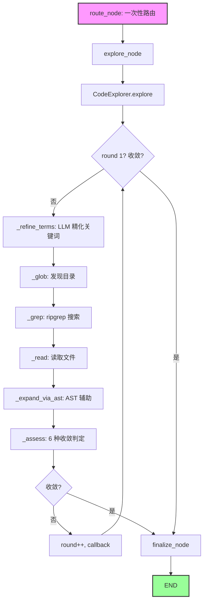
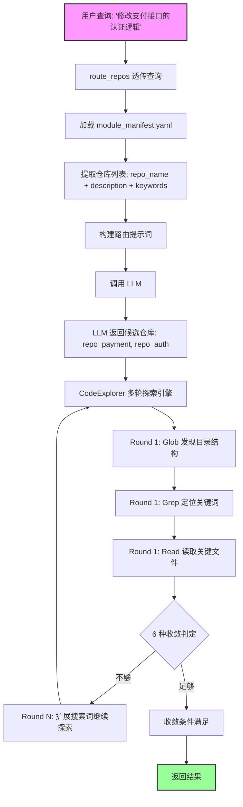
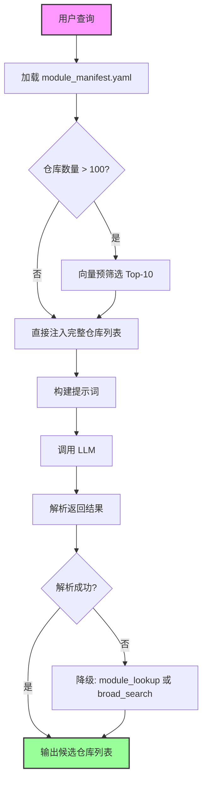
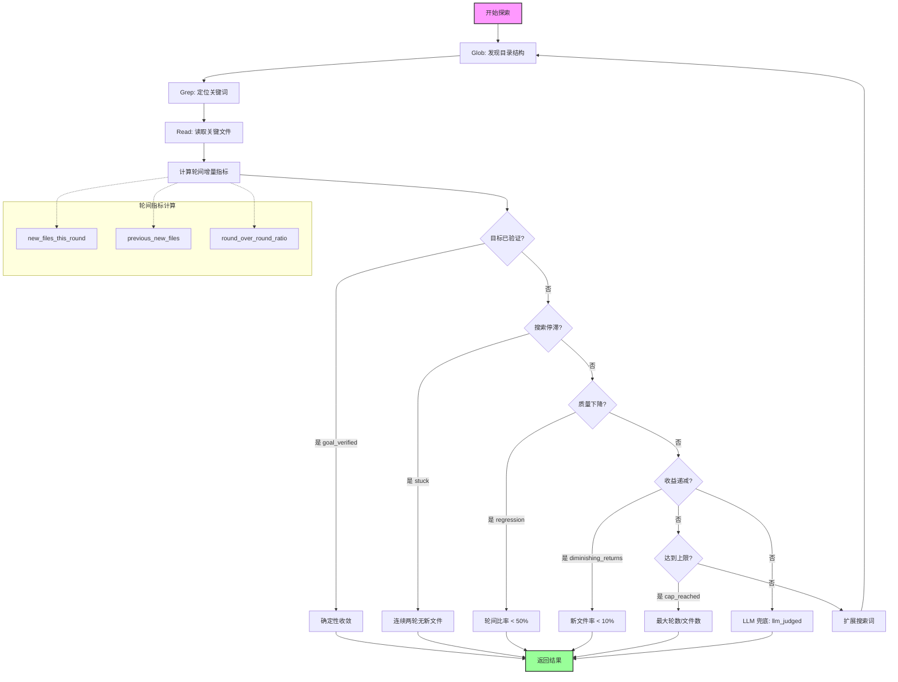

# Design: Code Agent 代码定位与分析方案

> 所属项目：[SPMA 全局概览](SPMA-design-00-global-overview.md)
> 相关模块：[Code Agent](SPMA-design-03-code-worker.md)
> 文档目的：定义 SPMA Code Agent 代码定位与分析的核心方案，基于 Claude Code 模型驱动探索策略，解决现有路由不准确的问题

***

## 一、核心参考与设计哲学

### 1.1 Claude Code 探索模式

Claude Code 采用**模型驱动的实时探索**策略，放弃传统 RAG 向量检索，其核心流程经过实践验证：

```
用户: "修一下 payment API 的 auth bug"

Step 1: Glob → 发现项目结构（**/payment/**, **/api/**）
Step 2: Grep → 定位关键符号（payment_api, auth, authenticate）
Step 3: Read → 读取完整文件上下文
Step 4: 理解 → LLM 在上下文中理解代码结构
Step 5: 重复 → 根据需要再 Grep → 再 Read → 再理解
```

### 1.2 设计哲学：零索引、实时搜索

**核心理念**：

- **零索引**：代码持续变更，索引过期问题严重。与其花费大量精力维护索引的时效性，不如直接实时搜索
- **实时搜索**：ripgrep 效果远超 RAG，能够在毫秒级返回精确结果
- **模型决策**：让 LLM 决定搜索策略和深度，而非依赖预定义的索引结构
- **多轮循环**：单次搜索难以覆盖所有相关代码，通过迭代探索逐步收敛

**关键洞察**：问题的本质是"从N个仓库中选几个相关的"，这是一个简单的分类问题，不需要复杂的预索引体系。

### 1.3 问题边界

本方案解决两个核心问题：

| 问题       | 描述           | 解决方式                               |
| -------- | ------------ | ---------------------------------- |
| **路由问题** | "该查哪个仓库？"    | LLM 根据仓库元数据直接选择候选仓库                |
| **搜索问题** | "仓库内该看哪些代码？" | Claude Code 模式实时探索（Glob→Grep→Read） |

***

## 二、现有问题

当前 Code Agent 存在以下核心问题：

### 2.1 实体抽取未生效（code\_refs / module 始终为空）

`extract_entities` 函数实现存在（`WorkerEntities` dataclass），但当前未在 prompt / pipeline 装配阶段被填充具体的 `code_refs` 与 `module`，导致所有查询都走 fallback 路由，无法精确定位目标仓库。

### 2.2 缺少中英文模块映射

`route_repos` 直接使用中文模块名进行文件路径匹配，用户说"用户登录"但代码文件名为英文（`auth.py`、`login.py`），导致路由失败。

### 2.3 仓库信息不完备

`repo_registry` 表缺少业务域标签、仓库依赖关系等信息，无法根据业务域进行精准路由。

***

## 三、新方案设计

### 3.1 设计点1：route\_repos 透传用户查询

**设计意图**：保留用户原始查询的完整语义，让 LLM 直接基于完整查询做决策。

**实现方式**：

```python
async def route_repos(
    query: str,              # 新增：用户原始查询
    entities: dict,          # 保留：实体信息（可选）
    file_path_cache,         # 保留：现有 file_path_cache 实例（用于 fallback）
    repo_registry,           # 新增：RepoRegistry 实例（YAML 数据源，主路径）
    max_candidates: int = 5,
) -> dict:
    """根据用户查询和实体信息路由到候选仓库。"""
```

**返回字段**（保留并扩展）：

| 字段                 | 类型          | 说明                                                                               |
| ------------------ | ----------- | -------------------------------------------------------------------------------- |
| `candidate_repos`  | `list[str]` | 候选仓库列表                                                                           |
| `route_method`     | `str`       | `llm_yaml_match`（主路径）/ `exact_file_match` / `module_lookup` / `broad_search`（兜底） |
| `route_confidence` | `str`       | `high` / `medium` / `low`                                                        |

> **重要**：`route_method` 新增主路径枚举值 `llm_yaml_match`；旧的 `exact_file_match` / `module_lookup` / `broad_search` 仍保留为兜底路径。下游消费方（如 `graph.py`）需在 `switch(route_method)` 处扩展一个分支。

**优势**：

- 信息完整，避免实体抽取（当前 `code_refs` / `module` 为空）丢失上下文
- 简化流程，主路径上不依赖实体抽取结果
- LLM 可以直接基于完整查询做语义理解

**失败模式**：

- LLM 调用失败（超时 / JSON 解析错误）→ 降级到 `file_path_cache` 的 `module_lookup` 路径
- LLM 返回的 `repo_names` 在 `RepoRegistry` 中不存在 → 过滤后若为空则降级到 `broad_search`
- YAML 未配置某个仓库 → `RepoRegistry.get_repo_by_name()` 返回 `None`，不进入候选

***

### 3.2 设计点2：扩展仓库元数据配置

**设计意图**：通过补充仓库的中文描述和关键词，解决中英文映射问题，为 LLM 提供足够的语义信息进行路由决策。

**数据源选择**：采用 `module_manifest.yaml` 作为**新增主路径**的数据源，启动时加载到内存。理由：

- 当前仓库数量较少（<50），内存加载足够高效
- YAML 配置更易于人工编辑和版本控制
- 避免数据库与配置文件的双重维护

**与现有** **`file_path_cache`** **的关系（迁移路径）**：

`file_path_cache` 表中的 `dir_module_map` 字段（用于 `module_lookup` 兜底路由）**保留不废弃**，原因：

1. YAML 是新增主路径（LLM 路由），但 LLM 调用失败 / 超时时需要降级到模块映射兜底
2. 旧版 `code_refs` 精确匹配路径（`exact_file_match`）仍依赖 `file_path_cache` 的 `query_files(ref)`，暂时无法用 YAML 替代
3. 后续如果验证 YAML 路径长期稳定（> 1 个季度），再考虑把 `dir_module_map` 字段迁移到 YAML

> **双数据源期间的不变量**：`file_path_cache.repo_name` 集合 ⊇ `module_manifest.yaml` 的 `repos[].name` 集合（YAML 出现的仓库必须在 DB 注册过；DB 多出来的老仓库暂不在路由范围）。

**配置方式**：通过 `module_manifest.yaml` 声明式配置：

```yaml
# module_manifest.yaml — 仓库路由元数据（启动时加载到 RepoRegistry）
#
# 字段约定：
#   name        — 必填，与 file_path_cache.repo_name 一致
#   description — 必填，中文自然语言描述，建议 1-2 句话覆盖核心职责
#   keywords    — 必填，中英文逗号分隔，5-10 个，覆盖用户常见问法
#   tech_stack  — 可选，技术栈关键词，仅用于辅助 LLM 路由判断
#
# 维护规范：
#   - 新增仓库必须在 file_path_cache 中先注册（双数据源不变量）
#   - 字段缺失会导致 RepoRegistry 启动 fail-fast（CI 应检查）

repos:
  - name: "repo_auth"
    description: "用户认证服务，负责登录、注册、权限校验"
    keywords: "用户登录, 认证, 权限, OAuth2, JWT"
    tech_stack: "Python, FastAPI, PostgreSQL"

  - name: "repo_billing"
    description: "账单核心服务，负责账单生成、查询和状态管理"
    keywords: "账单, 计费, 对账, 发票"
    tech_stack: "Python, PostgreSQL, RabbitMQ"

  - name: "repo_payment"
    description: "支付接口服务，负责支付流程和银行对接"
    keywords: "支付, 银行, 转账, 扣款"
    tech_stack: "Java, Spring Boot, MySQL"
```

**加载机制**：

```python
import yaml
from typing import list, dict

class RepoRegistry:
    """仓库元数据注册表——从 YAML 加载并提供查询接口。"""
    
    def __init__(self, manifest_path: str):
        self._manifest_path = manifest_path
        self._repos = self._load_manifest()
    
    def _load_manifest(self) -> list[dict]:
        """从 YAML 文件加载仓库元数据。"""
        with open(self._manifest_path, "r", encoding="utf-8") as f:
            data = yaml.safe_load(f)
        return data.get("repos", [])
    
    def get_all_repos(self) -> list[dict]:
        """获取所有仓库的元数据。"""
        return self._repos
    
    def get_repo_by_name(self, name: str) -> dict | None:
        """根据仓库名获取元数据。"""
        for repo in self._repos:
            if repo["name"] == name:
                return repo
        return None
```

**优势**：

- 仅需一行中文描述 + 关键词，LLM 即可完成路由
- 避免了复杂的模块抽象和文档生成管线
- 维护成本极低，变更只需修改 YAML
- 单一数据源，无数据一致性问题

***

### 3.3 设计点3：LLM 单阶段路由

**设计意图**：采用单阶段路由，直接从仓库列表中选择候选仓库，避免两阶段路由的间接层和额外 LLM 调用。

**路由流程**：

```
用户查询："修改支付接口的认证逻辑"
        │
        ▼
┌──────────────────────────────────┐
│ 加载 repo_registry 仓库列表       │
│ 提取：repo_name + description    │
│       + keywords                 │
└──────────────────────────────────┘
        │
        ▼
┌──────────────────────────────────┐
│ LLM 路由决策                      │
│ 输入：用户查询 + 仓库列表          │
│ 输出：候选仓库列表（3-5个）        │
└──────────────────────────────────┘
        │
        ▼
   候选仓库列表
```

**LLM 提示词设计**：

```python
async def route_repos(query: str, repos: list[dict], max_candidates: int = 5) -> dict:
    repo_list = "\n".join([
        f"- {r['repo_name']}: {r['description']} (关键词: {r['keywords']})"
        for r in repos
    ])
    
    prompt = f"""根据用户查询，选择最相关的代码仓库：

用户查询：{query}

仓库列表：
{repo_list}

请输出 JSON：{{"repo_names": ["仓库名1", "仓库名2", "仓库名3"], "reason": "选择理由"}}"""
    
    resp = await self._llm.ainvoke(prompt)
    return parse_json(resp.content)
```

**路由示例**：

```
用户查询："修改支付接口的认证逻辑"

仓库列表：
- repo_auth: 用户认证服务，负责登录、注册、权限校验 (关键词: 用户登录, 认证, 权限, OAuth2, JWT)
- repo_billing: 账单核心服务，负责账单生成、查询和状态管理 (关键词: 账单, 计费, 对账, 发票)
- repo_payment: 支付接口服务，负责支付流程和银行对接 (关键词: 支付, 银行, 转账, 扣款)

LLM 返回：
{"repo_names": ["repo_payment", "repo_auth"], "reason": "支付接口相关选择repo_payment，认证逻辑相关选择repo_auth"}
```

**优势**：

- 单阶段决策，减少一次 LLM 调用
- 无中间层（模块），避免模块定位错误导致的连锁失败
- 简单直接，易于理解和调试

***

### 3.4 设计点4：Claude Code 实时探索

**设计意图**：让 LLM 自主决定搜索策略和深度，逐步探索源码，放弃预建索引。

**探索流程**：

```
用户查询 → LLM 分析
        │
        ▼
┌──────────────────────────────────┐
│ Round 1: 初步探索                 │
│ Glob → 发现目录结构                │
│ Grep → 定位关键词                  │
│ Read → 读取关键文件                │
└──────────────────────────────────┘
        │
        ▼
┌──────────────────────────────────┐
│ LLM 判断是否足够                   │
│ ├─ 足够 → 返回结果                 │
│ └─ 不够 → 继续探索                 │
└──────────────────────────────────┘
        │ 不够
        ▼
┌──────────────────────────────────┐
│ Round N: 深度探索                 │
│ 根据已有上下文扩展搜索词            │
│ 继续 Glob/Grep/Read               │
└──────────────────────────────────┘
        │
        ▼
   收敛条件满足 → 返回结果
```

**收敛条件**（参考 Claude Code 固定点迭代机制，5 种确定性 + 1 种 LLM 兜底，详见 v2 升级后的 [completeness.py](src/spma/agents/code/completeness.py)）：

| 模式                       | 触发条件                                                            | 说明                          |
| ------------------------ | --------------------------------------------------------------- | --------------------------- |
| **goal\_verified**       | `code_refs` 非空 + `total_results ≥ 3` + `fallback_layer = 0`     | 目标已验证，确定性收敛（最高优先级）          |
| **stuck**                | `new_files_this_round = 0` 且 `previous_new_files = 0`（连续两轮无新文件） | 搜索陷入停滞                      |
| **regression**           | `round_over_round_ratio < 0.5` 且本轮 `total_results` 减少           | 质量下降，搜索发散                   |
| **diminishing\_returns** | 连续两轮 `new_files_rate < 0.10`                                    | 收益递减                        |
| **cap\_reached**         | `call_depth ≥ 6`（max\_rounds）或 `total_files ≥ 50`（max\_files）   | 硬上限触发                       |
| **llm\_judged**          | 以上均不命中，调用 `_llm_code_completeness_check` 让 LLM 判定 sufficient    | 兜底路径（成本最高，仅在 `llm` 参数非空时启用） |

**轮次 → fallback\_layer 映射**（与 `searcher.search()` 的 4 层降级 [searcher.py:22-83](src/spma/agents/code/searcher.py#L22-L83) 对齐）：

| 轮次 (round) | fallback\_layer | search 模式       | 适用场景            |
| ---------- | --------------- | --------------- | --------------- |
| 0          | 0               | exact (L0)      | 精确词命中，最高信度      |
| 1          | 1               | stem (L1)       | 精确词无果，按词干拆分     |
| 2          | 2               | fuzzy (L2)      | 词干无果，模糊匹配       |
| ≥ 3        | 3               | llm\_retry (L3) | 兜底，调用 LLM 重组关键词 |

**核心指标定义**：

| 指标                       | 计算公式                                           | 说明            |
| ------------------------ | ---------------------------------------------- | ------------- |
| `new_files_this_round`   | 本轮新增文件数                                        | 用于判断是否有新发现    |
| `new_files_rate`         | new\_files\_this\_round / total\_files         | 新文件占比，反映探索效率  |
| `round_over_round_ratio` | new\_files\_this\_round / previous\_new\_files | 轮间新文件数比率，反映趋势 |

**最大搜索限制**（v2 目标）：

- 最大轮数：6 轮
- 最大文件数：50 个
- 每轮最大搜索词：10 个

> **注**：当前 `graph.py` 默认 `max_rounds: int = 3`（[graph.py:17](src/spma/agents/code/graph.py#L17)）；v2 实施时由 `CodeExplorer` 构造函数默认 `max_rounds=6` 接管。

**与现有代码的接口衔接**：

**1. searcher.py 扩展**（v2 实施时落地）

> **状态**：当前 `RipgrepExecutor`（[searcher.py:15-207](src/spma/agents/code/searcher.py#L15-L207)）仅实现了 `search()` 方法（位于 [searcher.py:22-83](src/spma/agents/code/searcher.py#L22-L83)）和 `search_gitlog()` / `_rg_search()` 等辅助方法。**`glob_files()` 和 `read_files()` 是 v2 实施时需要新增的方法**——这是 `CodeExplorer._glob()` / `_read()` 阶段所依赖的核心能力（见 §3.5）。

现有 `search()` 方法支持 4 层（exact / stem / fuzzy / llm\_retry）分层搜索（`fallback_layer` 参数 0-3）。v2 实施时需要新增的方法签名：

```python
async def glob_files(self, pattern: str, candidate_repos: list[str]) -> list[dict]:
    """Glob 模式匹配，发现目录结构。"""
    results: list[dict] = []
    for repo_name in candidate_repos:
        repo_path = self._repo_paths.get(repo_name)
        if not repo_path:
            continue
        cmd = ["rg", "--files", "--glob", pattern, repo_path]
        # ... 执行命令并收集结果
        results.append({"repo": repo_name, "file_path": ...})
    return results

async def read_files(self, files: list[dict]) -> list[dict]:
    """读取指定文件内容。"""
    results: list[dict] = []
    for f in files:
        repo_path = self._repo_paths.get(f["repo"])
        if not repo_path:
            continue
        file_path = os.path.join(repo_path, f["file_path"])
        with open(file_path, "r", encoding="utf-8", errors="ignore") as fp:
            content = fp.read()
        results.append({"repo": f["repo"], "file_path": f["file_path"], "content": content})
    return results
```

**2. completeness.py 升级**（v2 实施时落地）

> **状态**：当前 `assess_code_completeness()` 函数（[completeness.py:17-44](src/spma/agents/code/completeness.py#L17-L44)）仅实现 3 级（`L1` / `L2` / `L3`）判定（见 [completeness.py:32](src/spma/agents/code/completeness.py#L32) / [L37](src/spma/agents/code/completeness.py#L37) / [L41](src/spma/agents/code/completeness.py#L41)）。**v2 实施时需要升级到 5+2 种收敛模式**（5 种确定性 + 2 种 LLM 路径返回），并新增 3 个参数（`previous_new_files` / `max_files` / `max_rounds`）。

**v2 前接口**（当前状态）：

- `ripgrep_results`: 搜索结果列表
- `expanded_context`: 扩展上下文（读取的文件内容）
- `entities`: 用户实体信息
- `call_depth`: 当前调用深度（用于 L2 收敛）
- `new_files_this_round`: 本轮新增文件数（用于 L2 收敛）
- `fallback_layer`: 当前 fallback 层级（用于 L1 收敛）
- `llm`: 可选，传入时启用 L3 兜底分支
- 返回 level 枚举：`L1` / `L2` / `L3`

**v2 目标接口**（升级后）：

- 新增 `previous_new_files: int = 0`（**`stuck` 模式判定必须**，由 `CodeExplorer` 内部状态机显式维护）
- 新增 `max_files: int = 50`（用于 `cap_reached`）
- 新增 `max_rounds: int = 6`（用于 `cap_reached`）
- 返回 level 枚举升级：`goal_verified` / `stuck` / `regression` / `diminishing_returns` / `cap_reached` / `expand` / `llm_judged`（7 种，其中 `llm_judged` 与 `expand` 都由 LLM 路径产生，区别是 LLM 判定 sufficient vs insufficient）

调用方：`CodeExplorer._assess()` 内部调用（见 §3.5.4），`ExplorerState` 内部维护 `previous_new_files` 跨轮传递。

**3. 多轮探索引擎**

详见 [§3.5 实现：CodeExplorer 与 graph.py 薄包装](#35-实现codeexplorer-与-graphpy-薄包装)。本节定义的设计意图（`Glob → Grep → Read` 循环、6 种收敛判定、轮次→fallback\_layer 映射、核心指标）在 §3.5 实现中**完整沿用**。

**优势**：

- 零索引，无需维护文档和摘要
- 实时搜索，结果始终与代码同步
- LLM 自主决策，适应复杂场景
- v2 实施后将 `completeness.py` 升级到 5+2 种收敛机制（5 确定性 + 2 LLM 路径）
- 多轮循环由独立 `CodeExplorer` 类承载，**可单测**（无需启动 LangGraph）

***

### 3.5 实现：CodeExplorer 与 graph.py 薄包装

> **本节范围**：定义 `CodeExplorer` 类的实现细节（状态模型、API、错误处理、测试），以及 `graph.py` 薄包装的具体形态。

#### 3.5.1 3 个关键问题与设计对策

通过对 [graph.py](src/spma/agents/code/graph.py) 的逐行审视，发现 3 个架构问题必须在实现中正面解决：

| ID  | 问题                                                                                | 设计对策                                                                |
| --- | --------------------------------------------------------------------------------- | ------------------------------------------------------------------- |
| P1  | 若 `assess` 跑在 `expand` 之前，第 1 轮 `new_files_this_round=0, previous_new_files=0` 立即触发 `stuck` 假收敛 | 把 `assess` 移到 `expand` 之后（顺序：refine → glob → grep → read → expand → assess） |
| P2  | `RipgrepExecutor` 若不显式实现 `glob_files()` / `read_files()`，多轮循环会缺 Glob 和 Read 步骤           | `CodeExplorer` 显式串联 6 个阶段方法（见 §3.5.4），不依赖状态机的隐式调度；任务 #5 前置补齐负责实现这 2 个方法 |
| P3  | `build_search_terms(entities)` 只读 entities，不读 `expanded_context`——违背"每轮精化关键词"的 Claude Code 核心机制 | 新增 `_refine_terms()` 阶段：基于上轮 `expanded_context` 调用 LLM 重组关键词            |

#### 3.5.2 架构总览

```
┌─────────────────────────────────────────────────────────────┐
│ graph.py (薄包装)                                            │
│                                                              │
│  [route_node] → [explore_node] → [finalize_node] → END     │
│                     │                                        │
│                     │  await code_explorer.explore(state)    │
│                     ▼                                        │
└─────────────────────────────────────────────────────────────┘
┌─────────────────────────────────────────────────────────────┐
│ CodeExplorer (新增类，src/spma/agents/code/explorer.py)     │
│                                                              │
│  +-- _state: ExplorerState (内部状态对象)                    │
│  +-- _on_round_complete: AsyncCallback (可观测性钩子)         │
│                                                              │
│  explore(initial: CodeAgentState) -> CodeAgentState         │
│     while not converged:                                     │
│        1. _refine_terms()        ← P3 对策                    │
│        2. _glob()                ← P2 对策                    │
│        3. _grep()                                               │
│        4. _read()                ← P2 对策                    │
│        5. _expand()              (AST 辅助)                   │
│        6. _assess()              ← P1 对策 (assess 移到最后)    │
│        7. emit on_round_complete  (回调)                      │
└─────────────────────────────────────────────────────────────┘
```

#### 3.5.3 内部状态模型（`ExplorerState`）

新增 dataclass，**与 LangGraph 的 `CodeAgentState` 分离**——Explorer 拥有自己的状态对象，仅在入口/出口做转换：

```python
@dataclass
class ExplorerState:
    """CodeExplorer 内部状态——独立于 LangGraph CodeAgentState。"""
    round: int = 0                          # 当前轮次（0-indexed）
    previous_new_files: int = 0              # 上轮新增文件数（stuck 判定用）
    new_files_this_round: int = 0            # 本轮新增文件数
    search_terms: dict = field(default_factory=dict)  # 当前轮精化后的关键词
    ripgrep_results: list[dict] = field(default_factory=list)
    expanded_context: list[dict] = field(default_factory=list)
    seen_files: set[tuple[str, str]] = field(default_factory=set)
    fallback_layer: int = 0
    call_depth: int = 0
    convergence: CodeCompletenessResult | None = None
```

**与 LangGraph 状态的边界**：

- **入口**（`explore()` 接收）：从 `CodeAgentState` 读取 `entities` / `candidate_repos` / `fallback_layer`，填充到 `ExplorerState`
- **出口**（`explore()` 返回）：把 `ExplorerState.ripgrep_results` / `expanded_context` / `convergence` 写回 `CodeAgentState` 的对应字段
- **不双向同步**：LangGraph 状态在 `explore()` 调用期间**冻结**，避免双写不一致

#### 3.5.4 `CodeExplorer` 类 API

```python
class CodeExplorer:
    """多轮探索引擎——封装 Glob→Grep→Read→Refine→Assess 循环。
    
    独立于 LangGraph：可通过 explore() 一次性调用，也可注入 mock 状态做单测。
    """

    def __init__(
        self,
        ripgrep_executor: RipgrepExecutor,
        ast_parser,
        llm,
        on_round_complete: Callable[[ExplorerState], Awaitable[None]] | None = None,
        max_rounds: int = 6,
        max_files: int = 50,
    ):
        self._executor = ripgrep_executor
        self._ast = ast_parser
        self._llm = llm
        self._on_round_complete = on_round_complete
        self._max_rounds = max_rounds
        self._max_files = max_files

    async def explore(self, graph_state: CodeAgentState) -> CodeAgentState:
        """一次性跑完多轮探索，返回写回的 graph_state。"""
        state = self._init_from_graph_state(graph_state)
        while not self._is_converged():
            await self._run_one_round(state)
            if self._on_round_complete:
                await self._on_round_complete(state)
        return self._write_back_to_graph_state(graph_state, state)

    # ---- 单步 API（单测用，常规 explore() 不会调用）----
    async def _run_one_round(self, state: ExplorerState) -> None:
        state.round += 1
        state.call_depth = state.round
        await self._refine_terms(state)            # P3 对策
        glob_hits = await self._glob(state)
        grep_hits = await self._grep(state)
        read_hits = await self._read(state, glob_hits + grep_hits)  # P2 对策
        await self._expand_via_ast(state)
        await self._assess(state)                  # P1 对策：assess 移到 expand 之后

    # ---- 6 个阶段方法（每阶段一个职责）----
    async def _refine_terms(self, state): ...      # 基于 expanded_context 精化（P3）
    async def _glob(self, state): ...             # 调 ripgrep_executor.glob_files（P2）
    async def _grep(self, state): ...             # 调 ripgrep_executor.search
    async def _read(self, state, candidates): ... # 调 ripgrep_executor.read_files（P2）
    async def _expand_via_ast(self, state): ...   # AST 辅助
    async def _assess(self, state): ...           # 调 assess_code_completeness（P1）
```

#### 3.5.5 graph.py 薄包装

```python
async def explore_node(state: CodeAgentState) -> dict:
    """薄包装——调用 CodeExplorer.explore() 一次完成。"""
    if progress:
        await progress.publish_step("code_worker", "exploring", "正在多轮探索…")

    async def on_round(es: ExplorerState):
        # 钩子：每轮结束发可观测事件
        if progress:
            await progress.publish_step(
                "code_worker", "round_complete",
                f"round={es.round} new_files={es.new_files_this_round} "
                f"converge={es.convergence.level if es.convergence else 'pending'}"
            )

    updated = await code_explorer.explore(state)
    return updated


def build_code_agent_graph(
    file_path_cache,
    ripgrep_executor,
    ast_parser,
    llm,
    max_rounds: int = 6,
    timeout_ms: int = 2000,
    progress=None,
) -> StateGraph:
    # Explorer 由 graph 内部构造（解耦：调用方不感知 Explorer 存在）
    code_explorer = CodeExplorer(
        ripgrep_executor=ripgrep_executor,
        ast_parser=ast_parser,
        llm=llm,
        on_round_complete=... ,   # 桥接 progress 回调
        max_rounds=max_rounds,
    )

    graph = StateGraph(CodeAgentState)
    graph.add_node("route", route_node)
    graph.add_node("explore", explore_node)
    graph.add_node("finalize", finalize_node)   # 把 Explorer 结果组装成 CodeAgentState 最终输出
    graph.set_entry_point("route")
    graph.add_edge("route", "explore")
    graph.add_edge("explore", "finalize")
    graph.add_edge("finalize", END)
    return graph.compile()
```

**状态机拓扑**（3 节点、3 边）：

```
[route] → [explore] → [finalize] → END
            ↓
        code_explorer.explore()  (内部 while 循环)
            ↓
        on_round_complete callback  →  progress.publish_step()
```

#### 3.5.6 错误处理

| 失败模式                            | Explorer 行为                                                                | graph.py 责任             |
| ------------------------------- | -------------------------------------------------------------------------- | ----------------------- |
| LLM 调用超时（`_refine_terms`）        | 捕获异常 → `search_terms` 保持上轮值 → 继续                                                  | 记录到 `code_explorer_refine_errors_total` |
| `_glob` 全仓库失败                   | 返回 `[]`，下一轮继续                                                                | 记录到 `code_searcher_timeout_total{op="glob"}` |
| `_grep` 单仓库失败                   | 单仓库跳过，不中断整轮                                                                  | 同上 `{op="grep"}`        |
| `_read` 文件 I/O 失败               | `errors="ignore"` 静默跳过该文件                                                       | 记录到 `code_searcher_fail_total{op="read"}` |
| `_assess` LLM 路径失败               | `_llm_code_completeness_check` 内部 `except` 兜底为 `expand`（已实现）                       | 无需额外处理                  |
| 达到 `max_rounds` 仍不收敛           | Explorer 返回 `convergence.level="cap_reached"`                                       | 记录最终轮次到 `code_explore_rounds`        |

#### 3.5.7 测试策略

**Explorer 单元测试**（独立于 LangGraph）：

| 测试                            | 覆盖点                                                |
| ----------------------------- | -------------------------------------------------- |
| `test_init_from_graph_state` | 从 LangGraph state 正确转换字段                            |
| `test_refine_terms_llm_fail`  | LLM 超时时 search\_terms 保持上轮值                        |
| `test_glob_grep_read_integration` | 3 个阶段串联，验证 P2 对策（glob/read 显式调用）              |
| `test_assess_after_expand`    | 验证 P1 对策：round 1 assess 看到真实 new\_files\_this\_round |
| `test_converge_stuck`         | 连续两轮 0 新文件 → `stuck`（boundary case：第 1 轮 vs 第 2 轮） |
| `test_max_rounds_cap`         | 达到 max\_rounds 仍不收敛 → 返回 `cap_reached`             |
| `test_callback_invoked`       | 每轮结束触发 `on_round_complete` 回调                       |

**集成测试**：

- 端到端 fixture（参考最近 commit `9f8c3f1`）：Testcontainers PG + 模拟 ripgrep executor
- 验证 graph 编译成功 + 跑通完整流程
- 验证 `on_round_complete` 回调每轮触发

#### 3.5.8 流程图



#### 3.5.9 关键设计要点回顾

| 维度       | 决策                                       | 关键参数 / 引用                                                    |
| -------- | ---------------------------------------- | ------------------------------------------------------------- |
| 节点顺序     | refine→glob→grep→read→expand→assess    | P1 对策：assess 必须最后                                 |
| Glob 接入  | `_glob()` 显式调用                          | P2 对策                                                       |
| Read 接入  | `_read()` 显式调用                          | P2 对策                                                       |
| 关键词精化    | 每轮 `_refine_terms()` 调用 LLM              | P3 对策                                                       |
| 状态所有权    | `ExplorerState` 独立 dataclass            | 与 LangGraph `CodeAgentState` 分离，入口/出口转换                      |
| 状态可测性    | 直接传 dataclass 即可                         | 无需启动 LangGraph                                              |
| 节点数      | 3（route / explore / finalize）            | 见 §3.5.5 状态机拓扑                                              |
| 循环驱动     | `CodeExplorer` 内部 `while`                | 与 LangGraph 条件边解耦                                          |
| 收敛判定     | 复用 `assess_code_completeness`（v2 实施后支持 5+2 模式）  | `previous_new_files` 由 Explorer 内部维护                     |
| 可观测性     | `on_round_complete` 回调                   | 每轮事件，桥接 `progress.publish_step`                            |
| 错误处理     | 6 种失败模式（见 §3.5.6）                       | LLM 超时 / ripgrep 失败 / 文件 I/O 失败 / 等                         |

***

## 四、规模化扩展路径

以下策略作为未来按需扩展的可选方案，**当前阶段不实现**。

### 4.1 触发条件

| 策略    | 触发条件         | 预期效果            |
| ----- | ------------ | --------------- |
| 向量预筛选 | 仓库数 > 100    | 先筛选到 10 个以内，再路由 |
| 分层摘要  | LLM 调用成本成为瓶颈 | 缓存摘要，减少实时探索次数   |
| 模块抽象  | 仓库数 > 500    | 两阶段路由（模块→仓库）    |

### 4.2 向量预筛选（仓库数 > 100 时启用）

```python
class VectorPreFilter:
    """向量预筛选器——在路由前筛选最相关的仓库。"""

    def __init__(self, vector_db, llm_embedder):
        self._db = vector_db
        self._embedder = llm_embedder

    async def filter_repos(self, query: str, top_k: int = 10) -> list[dict]:
        """根据查询向量筛选最相关的仓库。"""
        query_vector = await self._embedder.embed(query)
        results = await self._db.search(query_vector, top_k=top_k)
        
        return [
            {
                "repo_name": r["repo_name"],
                "description": r["description"],
                "similarity": r["similarity"],
            }
            for r in results
        ]
```

### 4.3 渐进式设计原则

- **当前**：单阶段路由 + 实时探索（仓库数 < 100）
- **中期**：向量预筛选 + 单阶段路由（仓库数 100-500）
- **远期**：两阶段路由（模块→仓库）+ 分层摘要（仓库数 > 500）

***

## 五、实施计划

### 5.1 第一阶段：核心功能验证（1-2 周）

> **任务执行顺序**：必须按表格行序执行（YAML 与 `RepoRegistry` 先就绪，路由与探索才有数据可用）。

| # | 任务                        | 优先级 | 描述                                                            | 验收标准（DoD）                                                                             |
| - | ------------------------- | --- | ------------------------------------------------------------- | ------------------------------------------------------------------------------------- |
| 1 | 创建 `module_manifest.yaml` | P0  | 声明式配置仓库元数据（新增主路径数据源）                                          | 所有现存仓库均填齐 `name` / `description` / `keywords` / `tech_stack`；通过 `yaml.safe_load` 校验通过 |
| 2 | 实现 `RepoRegistry` 类       | P0  | 从 YAML 加载仓库元数据，提供 `get_all_repos` / `get_repo_by_name`        | 单元测试覆盖空文件 / 缺字段 / 重复 `name` 三种异常路径                                                    |
| 3 | 修改 `route_repos`          | P0  | 添加 `query` 与 `repo_registry` 参数                               | 保留旧路径作为兜底；`route_method` 新增 `llm_yaml_match` 枚举值                                      |
| 4 | 实现单阶段路由（LLM 选仓库）          | P0  | LLM 直接从仓库列表中选择候选仓库                                            | 离线 replay 测试集 ≥ 30 条，路由准确率 ≥ 75%                                                      |
| 5 | **多轮探索前置补齐**                | P0  | 在 v2 主任务前先把 3 个底层能力补齐：① `searcher.py` 新增 `glob_files` / `read_files` 方法；② `completeness.py` 从 3 级（`L1/L2/L3`）升级为 5+2 模式 + 新增 3 个参数；③ `graph.py` 默认 `max_rounds` 由 3 提到 6 | ① `RipgrepExecutor` 暴露 2 个新方法且单元测试通过；② 7 种 level 枚举各跑通一个 fixture；③ `build_code_agent_graph` 默认 `max_rounds=6` 且保留向后兼容；三个改动**全部独立 commit** |
| 6 | 多轮探索：`CodeExplorer` 抽离 + graph.py 薄包装（见 §3.5） | P0 | 新增 `src/spma/agents/code/explorer.py`（~250 行），实现 6 阶段方法（refine/glob/grep/read/expand/assess）；改造 `graph.py` 为 3 节点薄包装；解决 P1（assess reorder）/P2（接 glob+read）/P3（每轮精化关键词）三类问题 | Explorer 单元测试 7 项全过；6 种收敛模式各跑通一个 fixture；`on_round_complete` 回调在每轮触发；`previous_new_files` 跨轮正确传递；依赖任务 #5 全部完成 |

### 5.2 第二阶段：优化与验证（1-2 周）

| 任务     | 优先级 | 描述               |
| ------ | --- | ---------------- |
| 优化提示词  | P1  | 提高路由准确性          |
| A/B 测试 | P1  | 新路由与旧路由并行，统计准确率  |
| 性能优化   | P1  | 并行化 Grep/Read 操作 |

***

## 六、关键设计决策

| 决策点   | 选择                 | 理由                      |
| ----- | ------------------ | ----------------------- |
| 路由策略  | 单阶段（直接选仓库）         | 简单直接，避免中间层带来的复杂性        |
| 仓库元数据 | 扩展 `repo_registry` | 仅需补充描述和关键词，成本极低         |
| 搜索方式  | 模型驱动实时探索           | Claude Code 实践证明效果优于预索引 |
| 收敛判断  | 三层递进（L1→L2→L3）     | 平衡效率和准确性                |
| 中英文映射 | LLM 自然处理           | 通过中文描述直接匹配用户中文查询        |
| 规模化扩展 | 渐进式设计              | 当前不需要的功能延迟到触发条件满足时实现    |

***

## 六.五、可观测性与测试策略

> 本节为评审补强章节，明确"路由准确率如何度量"与"上线前如何验证"，对应 §9.4 灰度策略与切换条件所需的量化支撑。

### 6.5.1 可观测性指标（Prometheus）

参考项目已有的 `qr_*` 指标命名（见最近 commit `d79762b feat(obs): add qr_cache_hit_ratio gauge`），新增以下 `code_*` 指标：

| 指标名                               | 类型        | 标签                     | 用途                                                                                  |
| --------------------------------- | --------- | ---------------------- | ----------------------------------------------------------------------------------- |
| `code_route_total`                | counter   | `route_method`         | 各路由路径命中次数（`llm_yaml_match` / `exact_file_match` / `module_lookup` / `broad_search`） |
| `code_route_confidence`           | counter   | `confidence`           | 各置信度档位命中次数                                                                          |
| `code_route_llm_latency_seconds`  | histogram | `route_method`         | LLM 路由调用延迟分布                                                                        |
| `code_route_accuracy_sample`      | counter   | `verdict`              | 人工标注 / 在线 A/B 评估的样本数                                                                |
| `code_explore_rounds`             | histogram | `converge_level`       | 探索收敛轮数分布（按 level 区分）                                                                |
| `code_searcher_timeout_total`     | counter   | `op`（search/glob/read） | ripgrep subprocess 超时次数                                                             |
| `code_searcher_fail_total`        | counter   | `op`                   | ripgrep 失败次数（非 0/1 退出码 / 文件 I/O 失败）                                                 |
| `code_repo_registry_load_seconds` | histogram | `status`               | `RepoRegistry` YAML 加载耗时与成败                                                         |

**告警规则**（与 §9.4 自动回滚触发器对齐）：

- `code_route_llm_latency_seconds:p99 > 3s`（5 分钟窗口）
- `rate(code_searcher_timeout_total[5m]) > 10`（按 op 拆分）
- `code_repo_registry_load_seconds:status="fail" increase > 0`（启动失败即时告警）

### 6.5.2 测试策略

**单元测试**（覆盖率目标 ≥ 85%）：

| 模块                         | 关键测试点                                                                                                           |
| -------------------------- | --------------------------------------------------------------------------------------------------------------- |
| `RepoRegistry`             | ① 空文件 / 缺字段 / 重复 `name` 异常；② 正常加载后 `get_repo_by_name` 命中率 100%                                                  |
| `RipgrepExecutor`          | ① `glob_files` / `read_files` 各 1 case；② `search` 4 层降级各 1 case；③ timeout 触发 kill 路径                            |
| `assess_code_completeness` | 6 种收敛模式各 1 case：`goal_verified` / `stuck` / `regression` / `diminishing_returns` / `cap_reached` / `llm_judged` |
| `route_repos`              | ① LLM YAML 主路径；② LLM 失败降级到 `module_lookup`；③ YAML 返回空 → `broad_search` 兜底                                       |

**集成测试**（基于 Testcontainers，参考最近 commit `9f8c3f1 test(qr): end-to-end integration`）：

- 端到端 fixture：用户查询 → `route_repos` → 多轮探索 → 收敛 → 返回结果
- 离线 replay 测试集：≥ 30 条标注样本（覆盖中英文混合查询、单仓库 / 多仓库命中、模糊查询场景）
- 准确率门槛：路由准确率 ≥ 80%（§9.2 阶段 1 切换条件）

**回滚演练**（§9.3 滚出策略的可执行验证）：

- 注入 `code_route_llm_latency_seconds` 异常（mock LLM 慢响应）→ 验证 5 分钟内自动触发回滚
- 注入 `module_manifest.yaml` 损坏 → 验证 `RepoRegistry` 启动 fail-fast 行为
- 演练频次：每次发版前必须跑通，记录到 release checklist

## 七、风险与权衡

| 风险                    | 影响                                            | 缓解措施                                                                                                                             |
| --------------------- | --------------------------------------------- | -------------------------------------------------------------------------------------------------------------------------------- |
| 路由准确性                 | 仓库描述不准确导致路由错误                                 | 提供模板化元数据填写指南；定期审核；离线 replay 测试集持续回归                                                                                              |
| LLM 调用成本              | 每查询一次 LLM（含探索收敛判定）                            | 设置 LLM 响应缓存（关键词级别）；`llm_judged` 路径只在确定性模式全失败时启用；限制每查询 LLM 调用 ≤ 2 次（1 次路由 + 1 次收敛）                                                |
| 响应时间                  | 多轮探索增加延迟                                      | 限制每轮搜索范围，优先精确匹配；`RipgrepExecutor` 单次 timeout 5s（[searcher.py:19](src/spma/agents/code/searcher.py#L19)），subprocess 终止后强制 kill 兜底 |
| 仓库数量增长                | 超过 100 个仓库时提示词超限                              | 预留向量预筛选作为扩展路径（见 §4）                                                                                                              |
| ripgrep subprocess 失败 | `_rg_search` 进程崩溃、仓库无文件、权限不足                  | 单仓库失败仅跳过该仓库（不中断整轮）；返回非 0 / 1 退出码时记录 stderr 前 200 字符告警                                                                            |
| ripgrep timeout       | 大仓库搜索超过 5s 阈值                                 | terminate → 2s grace → kill 三级兜底；超时计入 `searcher_timeout_total` 指标                                                                |
| 文件 I/O 失败             | `read_files` 读不到文件（权限/不存在/编码错误）               | `errors="ignore"` 静默跳过；记录 `read_files_fail_total` 指标                                                                             |
| YAML 配置漂移             | `module_manifest.yaml` 与实际仓库不一致（新增仓库未注册、字段缺失） | `RepoRegistry` 加载时严格校验（启动 fail-fast）；CI 增加 YAML 字段完整性检查                                                                          |
| 探索发散                  | 多轮探索陷入无效搜索（>6 轮）                              | `cap_reached` 硬截断；`previous_new_files` 状态维护使 `stuck` / `regression` 模式尽早触发                                                       |

***

## 八、与现有代码的适配

| 现有代码                  | 方案需求              | 适配方式                                                                                                                                                                         |
| --------------------- | ----------------- | ---------------------------------------------------------------------------------------------------------------------------------------------------------------------------- |
| `router.py`           | route\_repos 透传查询 | 修改函数签名，新增 `query` + `repo_registry` 参数；`route_method` 增加 `llm_yaml_match` 枚举                                                                                                 |
| `entity_extractor.py` | LLM 意图分析          | 复用现有实体抽取能力，作为路由辅助（当前 `code_refs` / `module` 仍可能为空）                                                                                                                           |
| `searcher.py`         | Glob→Grep→Read    | 当前仅有 `search()`（[searcher.py:22-83](src/spma/agents/code/searcher.py#L22-L83)）4 层降级；v2 实施时**新增** `glob_files` / `read_files` 方法以供 `CodeExplorer` 调用 |
| `completeness.py`     | 收敛判断              | 当前仅 3 级（`L1` / `L2` / `L3`）；v2 实施时**升级**为 5+2 模式（`goal_verified` / `stuck` / `regression` / `diminishing_returns` / `cap_reached` / `expand` / `llm_judged`），新增 `previous_new_files` / `max_files` / `max_rounds` 三个参数 |
| `graph.py`（状态机）       | 多轮探索循环            | 当前 4 节点内联状态机（route / search / assess / expand）；v2 实施时**改造**为 3 节点薄包装（route / explore / finalize），多轮循环移至 `CodeExplorer`（见 §3.5） |
| `explorer.py`（新增）       | 多轮探索引擎（独立类）       | v2 实施时新增；拥有 `ExplorerState`，暴露 `explore(state)` 一次性 API；通过 `on_round_complete` callback 暴露可观测事件；解决 P1/P2/P3 三类问题（见 §3.5.1） |
| `repo_registry`（DB 表） | 仓库元数据             | **保留为兜底数据源**（`module_lookup` / `exact_file_match` 仍依赖 `file_path_cache`）；新增 `RepoRegistry` 从 YAML 加载作为主路径                                                                    |
| `ASTParser`           | 结构提取              | 复用现有 TreeSitter 解析能力                                                                                                                                                         |
| `GitManager`          | 变更检测              | 复用 `handle_webhook()` 的 changed\_files 提取                                                                                                                                    |

***

## 九、迁移与滚出策略

### 9.1 当前状态分析

| 当前问题                                           | 影响                 | 迁移目标                                                     |
| ---------------------------------------------- | ------------------ | -------------------------------------------------------- |
| `extract_entities` 返回空的 `code_refs` 和 `module` | 所有查询走 fallback 路由  | 实现单阶段路由，直接选仓库                                            |
| `route_repos` 使用中文模块名进行路径匹配                    | 用户说"用户登录"但代码文件名为英文 | 通过中文 `description` 字段匹配                                  |
| `repo_registry` 缺少业务域标签                        | 无法根据业务域进行精准路由      | 创建 `module_manifest.yaml`，补充 `description`、`keywords` 字段 |

### 9.2 迁移路线图

#### 阶段0：准备阶段（第 0-1 周）

| 任务                        | 描述                    | 依赖 |
| ------------------------- | --------------------- | -- |
| 创建 `module_manifest.yaml` | 声明式配置仓库元数据（唯一数据源）     | 无  |
| 实现 `RepoRegistry` 类       | 从 YAML 加载仓库元数据，提供查询接口 | 无  |

#### 阶段1：路由能力增强（第 1-3 周）

| 任务               | 描述            | 风险 | 回滚方案              |
| ---------------- | ------------- | -- | ----------------- |
| 修改 `route_repos` | 添加 `query` 参数 | 低  | 保留原有逻辑作为 fallback |
| 实现单阶段路由          | LLM 直接选择仓库    | 中  | 路由失败时返回所有仓库       |
| A/B 测试           | 新路由与旧路由并行     | 低  | 切换回旧路由            |

**切换条件**：新路由准确率 ≥ 80%，持续 1 周

#### 阶段2：探索流程优化（第 3-4 周）

| 任务     | 描述       | 风险 | 回滚方案              |
| ------ | -------- | -- | ----------------- |
| 实现多轮探索 | 基于现有代码扩展 | 低  | 保留单轮搜索作为 fallback |
| 性能优化   | 并行化处理    | 中  | 关闭并行，恢复串行         |

### 9.3 滚出策略

#### 快速滚出（10 分钟内）

| 场景        | 操作                                          |
| --------- | ------------------------------------------- |
| 新路由导致严重错误 | 修改配置 `route.strategy = "fallback"`，切换回旧路由逻辑 |
| LLM 服务不可用 | 启用关键词匹配作为 fallback，关闭 LLM 调用                |

#### 完全回滚（1 小时内）

| 操作   | 描述                                  |
| ---- | ----------------------------------- |
| 代码回滚 | 回滚 `router.py` 和 `RepoRegistry` 类修改 |
| 配置回滚 | 删除 `module_manifest.yaml`           |

### 9.4 灰度发布策略

> **比例必须单调递增**：内部测试 0% 用户（只覆盖内部账号）→ 小流量 1% → 中流量 10% → 大流量 50% → 全量 100%。
> 每个阶段最短持续 24 小时，且该阶段 SLO 全部达标才能进入下一阶段。

| 阶段    | 范围      | 比例   | 监控重点          | 阶段准入（必须全部满足）                         |
| ----- | ------- | ---- | ------------- | ------------------------------------ |
| 内部测试  | 开发/测试人员 | 0%   | 路由准确率、响应时间    | 离线 replay 准确率 ≥ 80%                  |
| 小流量灰度 | 1% 用户   | 1%   | 用户反馈、错误率      | 错误率 < 1%、P99 延迟 < 5s                 |
| 中流量灰度 | 10% 用户  | 10%  | 系统性能、LLM 调用成本 | LLM 调用成功率 ≥ 99%、单查询 LLM 成本 ≤ ¥0.05   |
| 大流量灰度 | 50% 用户  | 50%  | 缓存命中率、CPU 负载  | L1 / L2 缓存命中率 ≥ 60%                  |
| 全量发布  | 100% 用户 | 100% | 全面监控          | 持续 7 天 SLO 全部达标（错误率 < 0.5%、P99 < 3s） |

**自动回滚触发器**（任一命中即立即回滚到上一阶段）：

- 路由错误率 > 5%（5 分钟窗口）
- P99 响应时间 > 10s（5 分钟窗口）
- LLM 5xx 比例 > 1%（5 分钟窗口）
- YAML 加载失败或字段缺失导致 `RepoRegistry` 初始化失败

***

## 十、架构图与流程图

### 10.1 端到端流程图



### 10.2 路由决策流程图



### 10.3 多轮探索流程图



